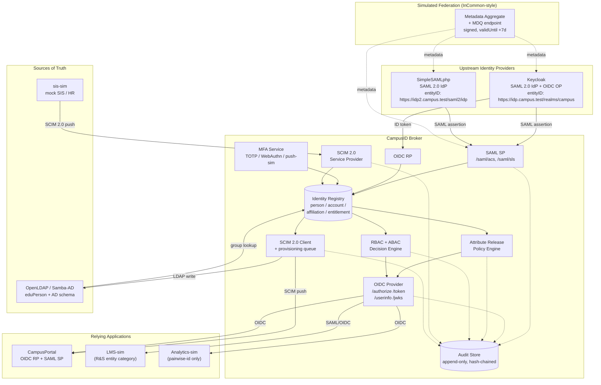
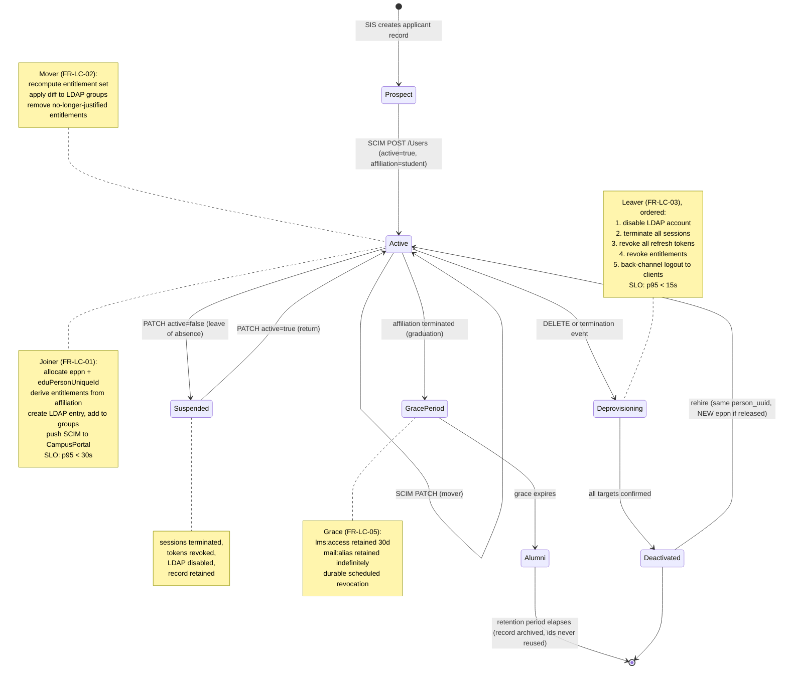
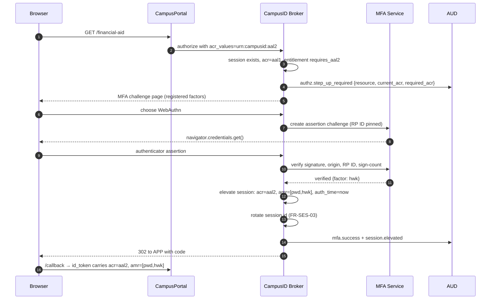
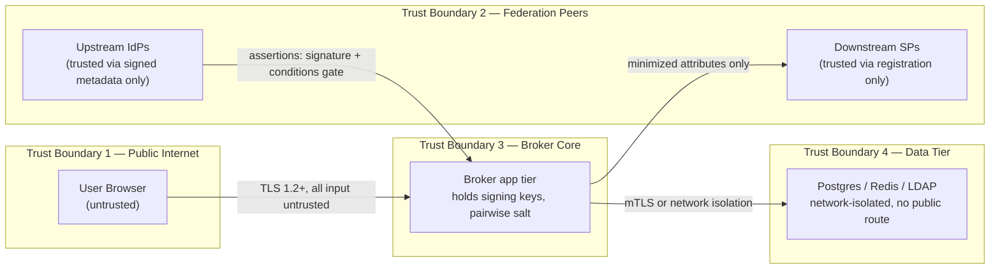

# CampusID — Product Requirements Document

**A SAML/OIDC identity broker with SCIM 2.0 provisioning, LDAP/AD integration, and campus-federation attribute release.**

| Field | Value |
|---|---|
| Document version | 1.0 |
| Status | Approved for build |
| Date | 2026-09-08 |
| Owner | Solo engineer (portfolio project) |
| Build window | 5 calendar weeks, ~20–25 hrs/week |
| Audience | University IAM analyst, InfoSec reviewer, hiring manager |
| Repo | `CampusID` |

**Requirement ID convention.** Every requirement carries a stable ID (`FR-<AREA>-nn`, `NFR-<AREA>-nn`). Every requirement has a **Verify** line naming the automated test, script, or artifact that proves it. A requirement with no Verify line is a bug in this document, not a feature.

---

## 1. Overview & Problem

### 1.1 The problem

A university runs on identity. A single student is simultaneously an applicant, an enrolled undergraduate, a work-study employee in the library, an alumnus, and — five years later — a re-admitted graduate student. Each of those states changes what they may see in the LMS, the health portal, the grant system, and the door-access controller. In most institutions this is handled by:

- a **Shibboleth or ADFS IdP** that speaks SAML 2.0 to ~200 internal apps and to the **InCommon** federation for external services (library e-resources, Canvas, Zoom, national research infrastructure);
- a **growing pile of SaaS apps that only speak OIDC**, each needing a separate integration;
- **manual account creation** driven by ticket queues, so a terminated employee's access lingers for days or weeks;
- **ad-hoc attribute release**, where an SP asks for "all the attributes" and someone releases the full directory record because saying no is harder than saying yes.

The failure modes are well known to anyone who has held the pager: an SP integration that works in test and fails in production because of a clock skew of 4 minutes; a departed adjunct who still has an active Kerberos principal; an ePPN that was reassigned to a new student and silently granted them the previous holder's grade records; a FERPA-suppressed student whose name got released to a third-party analytics SP because the release policy was written per-attribute instead of per-subject.

### 1.2 What CampusID is

CampusID is a **standards-native identity broker** that sits between upstream identity providers and downstream applications, and between an authoritative HR/SIS system and downstream account stores.

It plays four protocol roles simultaneously:

| Role | Protocol | Peer |
|---|---|---|
| **SAML 2.0 Service Provider** | SAML 2.0 Web Browser SSO | Upstream IdPs (Keycloak, SimpleSAMLphp) |
| **OIDC Relying Party** | OIDC authorization code + PKCE | Upstream OP (Keycloak) |
| **OIDC Provider (OP)** | OIDC authorization code + PKCE, discovery, JWKS | Downstream app (`CampusPortal`) |
| **SCIM 2.0 Service Provider + Client** | SCIM 2.0 (RFC 7643/7644) | Inbound from mock SIS; outbound to OpenLDAP and CampusPortal |

The **identity registry** in the middle is the actual product. Protocols are edges; the registry is where a person gets a durable identifier, an affiliation history, entitlements, group memberships, a FERPA disclosure flag, and an authenticator inventory. Everything else — assertion parsing, SCIM PATCH semantics, LDAP writes — is plumbing hung off that registry.

### 1.3 Why this is portfolio-grade

An IAM hiring manager can distinguish, in about four minutes, between someone who has *configured* an SSO integration and someone who *understands* one. The distinguishing artifacts are precisely the ones this project produces:

- A **replay cache** and a documented clock-skew tolerance, not just "signature validation: on".
- An **attribute release policy engine** with per-SP entity categories and a FERPA suppression override, not a static attribute map.
- A **deprovisioning path with a measured latency SLO**, not a nightly cron that nobody has timed.
- A **SCIM conformance test suite** covering PATCH `op: remove` on multi-valued attributes with a filter — the specific corner where most homegrown SCIM servers break.
- An **audit log designed for the security office**, answering "who saw this student's record, when, and under what release rule" rather than "an error occurred".

### 1.4 Non-problems (explicitly out of frame)

CampusID does not aim to replace Shibboleth IdP, Keycloak, Okta, or Entra ID. It is a broker and a registry. Upstream IdPs remain the credential authorities; CampusID never stores a primary password for a federated user.

---

## 2. Goals & Non-Goals

### 2.1 Goals

| # | Goal | Measured by |
|---|---|---|
| G1 | Federate one sample app to **two protocols** (SAML 2.0 and OIDC) against a real IdP, with no application code changes between them | `FR-SAML-*`, `FR-OP-*` acceptance tests both green against `CampusPortal` |
| G2 | Enforce **least-privilege attribute release** per SP, driven by entity category and subject-level FERPA flags | `FR-ARP-*`; policy decision recorded in audit log for 100% of assertions |
| G3 | Automate the **full joiner–mover–leaver lifecycle** from a mock SIS via SCIM 2.0, with deprovisioning latency under 60 seconds p95 | `NFR-PROV-01` load test report |
| G4 | Integrate a **directory (OpenLDAP in AD-compatible mode)** as both a read source for group membership and a write target for account state | `FR-DIR-*` integration tests against live LDAP container |
| G5 | Enforce **RBAC + ABAC** authorization decisions and **step-up MFA** at AAL2 with a phishing-resistant option | `FR-AZ-*`, `FR-MFA-*`; policy decision log |
| G6 | Produce an **audit trail and dashboard** sufficient for an InfoSec reviewer to answer the five questions in §5.10 without reading code | Manual review script `docs/reviews/infosec-walkthrough.md` |
| G7 | Ship with **CI that fails on protocol regressions** — SSO integration tests, SCIM conformance, security scans | GitHub Actions required checks on `main` |
| G8 | Be **reproducible in one command** on a clean machine (`docker compose up`), including seeded test identities and IdP metadata exchange | `NFR-OPS-01`; fresh-clone smoke test in CI |

### 2.2 Non-Goals

| # | Non-goal | Rationale |
|---|---|---|
| NG1 | Writing a SAML **IdP** (CampusID is an SP downstream-facing OP) | Weeks of XML signature work; Keycloak already does it correctly |
| NG2 | Production-grade HA, multi-region, or clustering | Single-node docker-compose with documented HA design in §6.3 |
| NG3 | Real InCommon membership or metadata registration | Simulated federation with a locally signed metadata aggregate + MDQ-style endpoint |
| NG4 | Real Duo/Okta Verify integration (paid tenants) | Duo-style push is **simulated**; TOTP and WebAuthn are real |
| NG5 | Password credential management (reset flows, password policy, breach lists) | Upstream IdP owns primary credentials; CampusID owns second factors only |
| NG6 | Privileged access management, PKI/CA operation, certificate lifecycle automation | Self-signed dev certs with a documented rotation runbook |
| NG7 | Handling real student PII | All data is synthetic; §10.4 explains what would change under real FERPA scope |
| NG8 | SAML ECP, holder-of-key (FAL3), or SAML attribute query profile | Documented as future work in §15.3 |

---

## 3. Personas

### 3.1 Persona A — Dana, University IAM Analyst

**Context.** 6 years in central IT at a public R1. Owns ~180 SP integrations, the Shibboleth IdP attribute-resolver config, and the ticket queue for "I can't log in." Reads XML for a living. Does not write much code but reads YAML, logs, and metadata fluently.

**What Dana needs from CampusID:**
- Add a new SP **without redeploying the broker** — drop metadata in, configure release, test, done.
- See exactly **which attributes were released to which SP for which subject**, because that is the first question every incident starts with.
- A **lifecycle view of one person**: when did they become staff, when did the SIS say they terminated, when did the LDAP account get disabled, and how long was the gap.
- Deterministic, replayable **test fixtures** — a "known good" user per affiliation.

**Evaluation lens.** Dana judges the project by whether it survives contact with reality: does it handle clock skew, IdP metadata rollover, an SP that sends an unsigned AuthnRequest, an ePPN that changes case, a SCIM PATCH with a filter expression, a user who exists in the SIS twice. Dana will try to break it in the first ten minutes by logging in as a suspended user.

**Primary success signal:** Dana can onboard a new SP end-to-end from the admin UI + docs in under 15 minutes without asking a question.

### 3.2 Persona B — Marcus, Information Security Office Reviewer

**Context.** Runs the security architecture review that every new campus system must pass before go-live. Works from a checklist derived from NIST SP 800-53 / 800-63, the campus data classification standard, and FERPA guidance from the Registrar's office. Approves, rejects, or approves-with-conditions.

**What Marcus needs from CampusID:**
- Evidence that **assertions are signed and validated**, with replay protection and bounded validity windows — and a test that fails if that regresses.
- A clear statement of **assurance level** (IAL/AAL/FAL) with the specific controls that justify it.
- **Attribute minimization** demonstrated, not asserted: proof that the analytics SP receives a pairwise identifier and no name.
- **Secrets handling**: no keys in git, documented rotation, signing key separation from TLS.
- A **complete, tamper-evident audit log** with retention and a documented incident-response query path.
- Answers to: *what happens when the IdP signing key rotates mid-session?* and *what does a compromised SP client secret let an attacker do?*

**Evaluation lens.** Marcus reads §11 (Security) and §10 (Standards & Compliance) first, then checks whether the code and CI actually enforce them. A control claimed in a doc but not enforced in a test is treated as absent. Marcus will grep for `verify=False`, `TLSVerify`, hardcoded secrets, and disabled signature checks.

**Primary success signal:** Marcus can complete a security review from `docs/security/` alone and finds every claimed control backed by a named test.

### 3.3 Persona C — Priya, Hiring Manager (IAM / Platform Security team)

**Context.** Hiring a junior IAM engineer. Reviews 40 portfolios a week; gives each about four minutes before deciding to read further. Has seen hundreds of "OAuth demo" projects and is bored by all of them.

**What Priya needs from CampusID:**
- The **README to prove depth in 90 seconds**: an architecture diagram, a sequence diagram, and a list of standards implemented with RFC numbers.
- Evidence of **judgment**, not just completion — a "design decisions and trade-offs" doc that shows the candidate knew what they were choosing *against*.
- Evidence the candidate understands **failure modes**: what breaks in production, and what was built to catch it.
- Working **CI badges** and a test count that includes negative tests (expired assertion rejected, wrong audience rejected, replayed assertion rejected).
- Something she can ask about in an interview and get a real answer: "walk me through what happens when the SIS marks someone terminated."

**Evaluation lens.** Priya is scanning for signal that this person would be trusted with the campus IdP config. Depth on one thing beats breadth on five. She is unimpressed by a project that only demonstrates happy paths, and specifically looks for the negative-test suite.

**Primary success signal:** Within four minutes, Priya can name three non-trivial things the candidate understands (e.g. attribute release policy, SCIM PATCH semantics, replay protection) and schedules a call.

---

## 4. User Stories

Stories are grouped by persona and carry the requirement IDs that satisfy them.

### 4.1 IAM Analyst (Dana)

| ID | Story | Satisfied by |
|---|---|---|
| US-01 | As an IAM analyst, I upload an SP's SAML metadata and choose a release policy, so a new app can federate without a code deploy. | FR-FED-02, FR-ARP-01, FR-ADM-02 |
| US-02 | As an IAM analyst, I look up a person and see every attribute released to every SP in the last 90 days, so I can answer "why does this app see my name?" | FR-AUD-03, FR-ADM-04 |
| US-03 | As an IAM analyst, I see a person's lifecycle timeline (SIS event → broker state → LDAP state), so I can prove deprovisioning happened. | FR-LC-06, FR-ADM-05 |
| US-04 | As an IAM analyst, I force-terminate a session for a compromised account and every downstream app logs the user out. | FR-SES-05, FR-ADM-06 |
| US-05 | As an IAM analyst, I test an SP integration against a synthetic user of a chosen affiliation before releasing to real users. | FR-ADM-03, FR-FED-06 |
| US-06 | As an IAM analyst, I mark a student FERPA-suppressed and directory attributes stop being released immediately. | FR-ARP-05 |
| US-07 | As an IAM analyst, I rotate the broker's SAML signing key with both keys published in metadata during the overlap window, so SPs don't break. | FR-FED-05, NFR-SEC-06 |

### 4.2 InfoSec Reviewer (Marcus)

| ID | Story | Satisfied by |
|---|---|---|
| US-08 | As a security reviewer, I confirm a replayed SAML assertion is rejected, so I know the replay cache works. | FR-SAML-07 |
| US-09 | As a security reviewer, I confirm an assertion with a mismatched `Audience` or `Destination` is rejected. | FR-SAML-05, FR-SAML-06 |
| US-10 | As a security reviewer, I verify that a low-assurance session cannot reach a high-risk entitlement without step-up MFA. | FR-MFA-04, FR-AZ-05 |
| US-11 | As a security reviewer, I query the audit log for all authentication failures for one subject across a date range. | FR-AUD-04 |
| US-12 | As a security reviewer, I confirm no secret material is committed to the repository and that CI enforces it. | NFR-SEC-07, FR-CI-04 |
| US-13 | As a security reviewer, I confirm the analytics SP receives a pairwise subject identifier that differs from the one issued to the LMS SP. | FR-ARP-04 |
| US-14 | As a security reviewer, I confirm session cookies are `HttpOnly`, `Secure`, `SameSite=Lax`, host-prefixed, and rotate on privilege change. | NFR-SEC-01, NFR-SEC-02 |

### 4.3 End User (Sam, a student — the subject, served through the app)

| ID | Story | Satisfied by |
|---|---|---|
| US-15 | As a student, I sign in once and reach the portal, the LMS, and the library proxy without re-entering credentials. | FR-SES-01 |
| US-16 | As a student, I enroll a TOTP app and a passkey, and can use either. | FR-MFA-01, FR-MFA-02 |
| US-17 | As a student, when I open my financial-aid record I am prompted for a second factor even though I am already signed in. | FR-MFA-04 |
| US-18 | As a student, I see which apps have my attributes and can review what was released. | FR-ARP-07 |
| US-19 | As a graduating student, my status changes to alumnus and I lose LMS access but keep email alias access. | FR-LC-04 |
| US-20 | As a user, single logout ends my session at the broker and at every app I visited. | FR-SES-04 |

### 4.4 Hiring Manager (Priya)

| ID | Story | Satisfied by |
|---|---|---|
| US-21 | As a reviewer, I run `docker compose up` on a clean machine and have a working federation in under 10 minutes. | NFR-OPS-01 |
| US-22 | As a reviewer, I read one page and understand the architecture and the standards implemented. | §16 README outline |
| US-23 | As a reviewer, I see the negative-test suite and the CI enforcing it. | §12.2, FR-CI-01 |

---

## 5. Functional Requirements

### 5.1 Federation & Metadata (FR-FED)

| ID | Requirement | Verify |
|---|---|---|
| FR-FED-01 | The broker publishes SP metadata at `GET /saml/metadata` containing `EntityDescriptor` with `SPSSODescriptor`, `AssertionConsumerService` (HTTP-POST), `SingleLogoutService` (HTTP-Redirect), signing + encryption `KeyDescriptor`s, `NameIDFormat`, `RequestedAttribute` list, and `<md:Organization>` / technical + security `ContactPerson`. | `test_metadata_schema.py` validates against `saml-schema-metadata-2.0.xsd` and asserts required elements present |
| FR-FED-02 | An operator can register an upstream IdP or downstream SP by uploading metadata XML or a metadata URL; the entity is usable without process restart. | `test_dynamic_entity_registration.py`: register → immediately complete an SSO flow |
| FR-FED-03 | Metadata fetched by URL is refreshed on a configurable interval (default 3600 s), signature-verified against a configured metadata-signing certificate, and rejected if `validUntil` has passed or `cacheDuration` is exceeded by more than 24 h. | `test_metadata_refresh.py`: serve expired metadata → refresh rejected, previous good copy retained, `metadata.refresh.failed` audit event emitted |
| FR-FED-04 | A simulated federation aggregate is published at `GET /federation/metadata.xml` (signed, `validUntil` = now + 7 d) and a per-entity MDQ-style endpoint at `GET /federation/entities/{sha1-urlencoded-entityID}`. | `test_federation_aggregate.py`: aggregate signature verifies; MDQ returns the same entity descriptor byte-identical in content |
| FR-FED-05 | The broker supports **two active signing keys** in metadata simultaneously (rotation overlap); it signs with the primary and accepts verification against either. | `test_key_rollover.py`: sign with key B while metadata advertises A+B; peer validation succeeds |
| FR-FED-06 | An operator can trigger a synthetic SSO test against any registered IdP with a chosen fixture user and view the decoded assertion (attributes, conditions, signature status) without completing a real login. | `test_sp_diagnostic.py` asserts the diagnostic returns parsed conditions and per-attribute release decisions |
| FR-FED-07 | Entity metadata may carry **entity attributes** (`urn:oasis:names:tc:SAML:metadata:attribute:EntityAttributes`), specifically the R&S entity category and SIRTFI assurance; these drive default release policy. | `test_entity_categories.py`: entity with R&S category receives the R&S bundle without explicit per-attribute config |

### 5.2 SAML 2.0 SP Flows (FR-SAML)

| ID | Requirement | Verify |
|---|---|---|
| FR-SAML-01 | SP-initiated SSO: the broker generates an `AuthnRequest` (HTTP-Redirect binding, `SigAlg=rsa-sha256`), with unique `ID`, `IssueInstant`, `Destination`, `AssertionConsumerServiceURL`, and `ProtocolBinding=HTTP-POST`, and stores request state (relay state, ID, timestamp) server-side. | `test_saml_authnrequest.py`: request parses, signature verifies with SP cert, ID recorded in request store |
| FR-SAML-02 | The broker accepts a SAML `Response` on `POST /saml/acs`, requiring: a valid XML signature on the `Response` **or** the `Assertion` (configurable per-IdP, default: assertion signature required), signature algorithm ∈ {rsa-sha256, rsa-sha384, rsa-sha512, ecdsa-sha256}, and a certificate matching the IdP metadata. | `test_saml_response_signature.py` (positive) + `test_saml_signature_negative.py` (unsigned, wrong key, SHA-1, `xmlsec` transform tricks all rejected) |
| FR-SAML-03 | Encrypted assertions (`EncryptedAssertion`, AES-128/256-GCM with RSA-OAEP key transport) are decrypted with the SP encryption key. Assertion encryption is **required** for any SP whose release policy includes non-directory attributes. | `test_saml_encrypted_assertion.py`; policy test asserts config rejects plaintext for restricted-attribute SPs |
| FR-SAML-04 | Time conditions are enforced: `NotBefore` ≤ now + skew, `NotOnOrAfter` > now − skew, `SubjectConfirmationData/@NotOnOrAfter` > now, with configurable clock skew (default 180 s, max 300 s). | `test_saml_conditions.py`: assertions at −301 s, +301 s, exactly at boundary — all four cases asserted |
| FR-SAML-05 | `Conditions/AudienceRestriction/Audience` must equal the broker's entityID. | `test_saml_audience.py`: mismatched audience → HTTP 400, `saml.assertion.rejected` audit event with `reason=audience_mismatch` |
| FR-SAML-06 | `Response/@Destination` must equal the ACS URL, and `Response/@InResponseTo` must match an outstanding request ID that has not expired (default 5 min) — unless the flow is IdP-initiated and IdP-initiated SSO is explicitly enabled for that IdP (default: disabled). | `test_saml_destination_inresponseto.py` covers all four combinations |
| FR-SAML-07 | **Replay protection**: assertion `ID` values are recorded in a Redis-backed cache with TTL = assertion validity window + skew; a second presentation of the same ID is rejected. | `test_saml_replay.py`: POST identical response twice → first 302, second 400 with `reason=replay_detected` |
| FR-SAML-08 | XML parsing is hardened: external entity resolution disabled, DTDs disabled, entity expansion limited; XML Signature wrapping (XSW) attacks are rejected by validating that the signed element is the same element used for assertion data (`ID` reference check + single-assertion enforcement). | `test_xsw_attacks.py` — 8 XSW variants from the Somorovsky taxonomy, all rejected |
| FR-SAML-09 | `NameID` formats `persistent`, `transient`, `emailAddress`, and `unspecified` are accepted; the persistent identifier is stored scoped to `(idp_entity_id, sp_entity_id, name_id_value)`. | `test_nameid_formats.py` |
| FR-SAML-10 | Multiple upstream IdPs are supported with a **discovery service** (`GET /disco`) implementing the SAML IdP Discovery Protocol (`entityID`, `return`, `returnIDParam` params) plus a last-used-IdP cookie. | `test_discovery.py`: redirect chain preserves `return`/`returnIDParam`; cookie shortcut path |
| FR-SAML-11 | The requested authentication context is propagated: the broker sends `RequestedAuthnContext` with `urn:oasis:names:tc:SAML:2.0:ac:classes:PasswordProtectedTransport` or `https://refeds.org/profile/mfa` depending on the downstream request, `Comparison=exact`, and validates the returned `AuthnContextClassRef` matches. | `test_authn_context.py`: request REFEDS MFA, IdP returns Password → session marked AAL1, step-up triggered |

### 5.3 Attribute Release Policy (FR-ARP)

The release engine evaluates, in order: **(1)** subject-level suppression → **(2)** SP entity category defaults → **(3)** explicit per-SP allow rules → **(4)** consent (if configured) → **(5)** value-level filters. The result — released set, denied set, and the rule that decided each — is recorded per assertion.

| ID | Requirement | Verify |
|---|---|---|
| FR-ARP-01 | Release policy is expressed as declarative YAML per SP entityID, hot-reloadable, with rule kinds: `allow` (attribute), `allow-value` (regex/exact filter on values), `deny`, `require-consent`, `category`. | `test_arp_policy_load.py`; `test_arp_hot_reload.py` |
| FR-ARP-02 | Default-deny: an attribute with no matching allow rule is never released. | `test_arp_default_deny.py`: SP with empty policy receives only `subject-id` |
| FR-ARP-03 | The **REFEDS R&S** bundle (`eduPersonPrincipalName`, `mail`, `displayName` or `givenName`+`sn`, `eduPersonScopedAffiliation`, `subject-id`) is released automatically to SPs tagged with the R&S entity category. | `test_arp_rs_bundle.py`: exact released set equals the R&S set, no more |
| FR-ARP-04 | **Pairwise subject identifiers**: SPs configured for pairwise receive `urn:oasis:names:tc:SAML:attribute:pairwise-id` (OIDC: `sub`) computed as `base64url(HMAC-SHA256(salt, person_uuid \|\| sp_entity_id))@scope`, stable per (person, SP) and different across SPs. | `test_pairwise_id.py`: same person + two SPs → different values; same person + same SP across sessions → identical |
| FR-ARP-05 | A subject-level `ferpa_directory_suppressed` flag blocks release of every attribute classified `directory` or `restricted` to any SP not marked `internal_school_official`, regardless of other allow rules. Effective immediately (no cache older than 60 s). | `test_ferpa_suppression.py`: set flag → next assertion contains only `pairwise-id`; audit event `arp.suppressed` |
| FR-ARP-06 | Every attribute release decision produces an audit record: `(subject, sp_entity_id, attribute, decision, rule_id, timestamp)`. | `test_arp_audit.py`: released + denied attributes both appear |
| FR-ARP-07 | Subjects can view their own release history at `GET /me/releases` (last 90 days). | `test_self_service_releases.py` |
| FR-ARP-08 | Attribute values are normalized before release: `eduPersonPrincipalName` lowercased, scope validated against configured scope, `eduPersonScopedAffiliation` values constrained to the eduPerson controlled vocabulary. | `test_attribute_normalization.py`: `Sam.Jones@CAMPUS.EDU` → `sam.jones@campus.edu`; unscoped or wrong-scope value rejected with `arp.scope_violation` |

### 5.4 OIDC — Downstream Provider (FR-OP) and Upstream RP (FR-RP)

**Downstream OP** (CampusID → `CampusPortal` and other clients):

| ID | Requirement | Verify |
|---|---|---|
| FR-OP-01 | Discovery document at `GET /.well-known/openid-configuration` advertising: `issuer`, `authorization_endpoint`, `token_endpoint`, `userinfo_endpoint`, `jwks_uri`, `end_session_endpoint`, `pushed_authorization_request_endpoint`, `introspection_endpoint`, `revocation_endpoint`, supported scopes/claims/response types, `code_challenge_methods_supported: ["S256"]`, `id_token_signing_alg_values_supported: ["RS256"]`. | `test_oidc_discovery.py` validates against OIDC Discovery 1.0 required fields |
| FR-OP-02 | JWKS at `GET /.well-known/jwks.json` with `kid`, RSA 2048+ (or EC P-256), and **two keys during rotation**. | `test_jwks.py`; `test_oidc_key_rotation.py`: tokens signed with old `kid` verify until expiry |
| FR-OP-03 | Authorization code flow with **mandatory PKCE S256** for all clients (public and confidential); `plain` rejected; missing `code_challenge` rejected with `invalid_request`. | `test_pkce_required.py` (3 negative cases) |
| FR-OP-04 | Authorization codes are single-use, 60 s TTL, bound to `client_id`, `redirect_uri`, and `code_challenge`; reuse revokes the entire token family issued from that code. | `test_code_replay.py`: reuse → `invalid_grant` **and** previously issued refresh token revoked |
| FR-OP-05 | `redirect_uri` matching is exact string comparison against registered values; no wildcards, no path-prefix matching. Loopback (`http://127.0.0.1:*`) permitted only for clients typed `native`. | `test_redirect_uri_matching.py` (8 near-miss cases incl. trailing slash, differing case in path, added query param, open-redirect payload) |
| FR-OP-06 | `state` and `nonce` are required for the code flow; `nonce` is bound into the ID token and validated as single-use per session. | `test_state_nonce.py` |
| FR-OP-07 | Pushed Authorization Requests (RFC 9126) supported at `POST /oauth2/par`; `request_uri` TTL 90 s, single-use. Clients may be configured `require_pushed_authorization_requests: true`. | `test_par.py` |
| FR-OP-08 | Refresh tokens rotate on each use with reuse detection: presenting a rotated-away refresh token revokes the whole family and emits `oauth.refresh_reuse_detected`. | `test_refresh_rotation.py` |
| FR-OP-09 | Token introspection (RFC 7662) and revocation (RFC 7009) endpoints, authenticated with client credentials; introspection of another client's token returns `{"active": false}`. | `test_introspection_revocation.py` |
| FR-OP-10 | ID token contains `iss`, `sub`, `aud`, `exp`, `iat`, `auth_time`, `nonce`, `acr`, `amr`, `sid`; RS256; 5 min lifetime. Identity attributes are **not** placed in the ID token unless the client requests the corresponding scope. | `test_id_token_claims.py` (asserts exact claim set for scope `openid` alone) |
| FR-OP-11 | `GET /userinfo` returns claims filtered by granted scope and by the same attribute release policy engine used for SAML (§5.3). | `test_userinfo_scoping.py`: OIDC and SAML release identical sets for the same policy |
| FR-OP-12 | OIDC Back-Channel Logout: on session termination, a signed `logout_token` (with `sid`, `events`) is POSTed to each client's `backchannel_logout_uri`; delivery retried 3× with exponential backoff; failures audited. | `test_backchannel_logout.py` incl. failing endpoint → retries + `logout.delivery_failed` |
| FR-OP-13 | The `acr` claim carries the achieved assurance (`urn:campusid:aal1` / `aal2` / `https://refeds.org/profile/mfa`), and clients may request a minimum via `acr_values`; an unmet request triggers step-up rather than silent downgrade. | `test_acr_step_up.py` |

**Upstream RP** (CampusID → Keycloak OP):

| ID | Requirement | Verify |
|---|---|---|
| FR-RP-01 | The broker authenticates users against an upstream OP using authorization code + PKCE, validating ID token `iss`, `aud`, `exp`, `iat` (≤ 300 s skew), `nonce`, signature against the OP's JWKS (cached, refreshed on unknown `kid`, rate-limited to 1 refresh/min). | `test_upstream_oidc.py`; `test_jwks_kid_rotation.py` |
| FR-RP-02 | Upstream claims are mapped to the internal identity model via a configurable claim-mapping table (e.g. `preferred_username` → `eppn`, `groups` → group memberships). | `test_claim_mapping.py` |
| FR-RP-03 | The same physical person authenticating via SAML IdP or upstream OIDC OP resolves to **one** `person` record via account linking rules (§8.4). | `test_account_linking.py`: SAML login then OIDC login → single `person_uuid`, two `account` rows |

### 5.5 Session & Logout (FR-SES)

| ID | Requirement | Verify |
|---|---|---|
| FR-SES-01 | A broker SSO session enables subsequent downstream authorizations without re-authentication, subject to `max_age` and assurance checks. | `test_sso_reuse.py`: second client authorizes with no credential prompt |
| FR-SES-02 | Session lifetime: idle timeout 30 min, absolute maximum 12 h; both enforced server-side (not by cookie expiry alone). | `test_session_timeouts.py` with clock injection |
| FR-SES-03 | Session identifiers are rotated on authentication, on assurance elevation (step-up), and on any privilege change. | `test_session_fixation.py`: pre-auth session ID is invalid post-auth |
| FR-SES-04 | Logout at the broker triggers: (a) SAML SLO to the upstream IdP where supported, (b) OIDC back-channel logout to every client with an active `sid`, (c) local session destruction. Partial failures do not block local destruction. | `test_global_logout.py` |
| FR-SES-05 | An administrator can terminate all sessions for a subject; termination propagates via back-channel logout within 10 s. | `test_admin_session_kill.py` |
| FR-SES-06 | Session state is stored server-side in Redis keyed by an opaque 256-bit identifier; the cookie contains no identity data. | `test_session_opacity.py`: cookie value decodes to nothing meaningful; server-side deletion invalidates immediately |

### 5.6 SCIM 2.0 — Inbound Provisioning (FR-SCIM)

CampusID exposes a SCIM 2.0 **service provider** consumed by the mock SIS (`sis-sim`), and acts as a SCIM **client** toward downstream targets.

| ID | Requirement | Verify |
|---|---|---|
| FR-SCIM-01 | `GET /scim/v2/ServiceProviderConfig`, `/ResourceTypes`, `/Schemas` return spec-conformant documents describing supported features (patch: true, bulk: true/maxOperations 100, filter: true/maxResults 200, changePassword: false, sort: true, etag: true). | `test_scim_discovery.py` validates against RFC 7643 §5 schemas |
| FR-SCIM-02 | `POST /scim/v2/Users` creates a user from `urn:ietf:params:scim:schemas:core:2.0:User` + `urn:ietf:params:scim:schemas:extension:enterprise:2.0:User`; returns 201 with `Location`, `meta.version` (ETag), and the canonical representation. Duplicate `userName` returns 409 with `scimType: uniqueness`. | `test_scim_create.py` |
| FR-SCIM-03 | `GET /scim/v2/Users/{id}` supports `attributes` / `excludedAttributes` projection and returns 404 with a SCIM error body for unknown ids. | `test_scim_read.py` |
| FR-SCIM-04 | `PUT /scim/v2/Users/{id}` replaces the resource; unspecified non-required attributes are cleared; immutable attributes may not change (409 `mutability`). | `test_scim_replace.py` |
| FR-SCIM-05 | `PATCH /scim/v2/Users/{id}` implements RFC 7644 §3.5.2 fully: `add`, `remove`, `replace`; paths with attribute, sub-attribute, **and value filters** (e.g. `emails[type eq "work"].value`); `remove` on a multi-valued attribute with a filter; `add` to a multi-valued attribute appends without duplicating. | `test_scim_patch.py` — 22 cases derived from RFC 7644 §3.5.2 examples, incl. all figure examples |
| FR-SCIM-06 | `DELETE /scim/v2/Users/{id}` performs a **soft delete** (`active: false` + `meta.deleted`), retaining the record for audit; hard delete is available only via admin API with justification. | `test_scim_delete.py` |
| FR-SCIM-07 | `GET /scim/v2/Users?filter=...` supports the RFC 7644 §3.4.2.2 filter grammar: `eq ne co sw ew gt ge lt le pr`, `and or not`, grouping, and complex attribute filters. Invalid filters return 400 `invalidFilter`. | `test_scim_filter.py` — 30 filter expressions incl. 6 malformed |
| FR-SCIM-08 | List responses use `urn:ietf:params:scim:api:messages:2.0:ListResponse` with `totalResults`, `startIndex` (1-based), `itemsPerPage`, and honor `count`/`startIndex` pagination and `sortBy`/`sortOrder`. | `test_scim_pagination.py`: page through 250 users, assert no gaps or duplicates |
| FR-SCIM-09 | Optimistic concurrency: `ETag` returned on every resource; `If-Match` mismatch returns 412; `If-None-Match` supported on GET. | `test_scim_etag.py` |
| FR-SCIM-10 | `POST /scim/v2/Bulk` processes up to 100 operations, supports `bulkId` references between operations, and honors `failOnErrors`. | `test_scim_bulk.py` |
| FR-SCIM-11 | `/scim/v2/Groups` supports the same CRUD + PATCH surface; group `members` PATCH `add`/`remove` operates on 10 000-member groups without full-collection rewrite. | `test_scim_groups.py`; perf assertion < 500 ms for single-member PATCH on 10k group |
| FR-SCIM-12 | All errors use `urn:ietf:params:scim:api:messages:2.0:Error` with `status`, `scimType`, `detail`. | `test_scim_errors.py` asserts body shape for 400/401/403/404/409/412/413 |
| FR-SCIM-13 | The SCIM API is authenticated by OAuth 2.0 bearer token with scope `scim:write` (mutations) or `scim:read`; client-credentials grant; token bound to a registered provisioning client. | `test_scim_authz.py`: read-scope token on POST → 403 |
| FR-SCIM-14 | All SCIM mutations are idempotent under retry: replaying a create with the same `externalId` returns the existing resource (200) rather than a duplicate. | `test_scim_idempotency.py` |

### 5.7 Identity Lifecycle (FR-LC)

| ID | Requirement | Verify |
|---|---|---|
| FR-LC-01 | **Joiner**: a SCIM create with an affiliation triggers: person record creation, unique `eppn` allocation, entitlement derivation from role rules, LDAP account creation, and downstream SCIM push to CampusPortal — all within the latency budget in NFR-PROV-01. | `test_lifecycle_joiner.py` (end-to-end against live LDAP + portal containers) |
| FR-LC-02 | **Mover**: an affiliation change (e.g. `student` → `student` + `employee`) recomputes entitlements, adds/removes group memberships, and emits a diff; entitlements no longer justified are removed, not merely superseded. | `test_lifecycle_mover.py`: assert removed entitlement is absent from LDAP and from the next assertion |
| FR-LC-03 | **Leaver**: `active: false` or affiliation termination disables the LDAP account (`userAccountControl` disable bit / `pwdAccountLockedTime`), terminates all sessions, revokes all refresh tokens, and marks entitlements revoked — in that order, with each step audited. | `test_lifecycle_leaver.py` asserts ordering and completeness; `test_leaver_session_kill.py` |
| FR-LC-04 | **Affiliation transition rules** are declarative: a graduating student becomes `alum`, losing `lms:access` and retaining `mail:alias`. Rules live in `config/lifecycle_rules.yaml`. | `test_affiliation_transitions.py` — matrix of 12 transitions with expected entitlement deltas |
| FR-LC-05 | **Grace periods**: a rule may retain an entitlement for N days after affiliation loss (e.g. LMS access for 30 days post-term); the scheduled revocation is durable across restarts. | `test_grace_period.py` with time travel; restart mid-grace and assert revocation still fires |
| FR-LC-06 | Every lifecycle transition writes a timeline event `(person, event_type, source, before_state, after_state, timestamp, correlation_id)` viewable in the admin UI. | `test_lifecycle_timeline.py` |
| FR-LC-07 | **Reconciliation**: a scheduled job compares broker state to LDAP and to CampusPortal, reports drift, and can remediate in dry-run or apply mode. | `test_reconciliation.py`: manually mutate LDAP out-of-band → drift detected and remediated |
| FR-LC-08 | **ePPN reuse protection**: an ePPN released to a previous person is never reassigned; the internal `person_uuid` and `eduPersonUniqueId` are permanent and never reused. | `test_eppn_reuse.py`: delete person then create a same-named person → different `eppn` (suffixed) and different `uniqueId` |
| FR-LC-09 | Provisioning to downstream targets is retried with exponential backoff (5 attempts, jitter) and dead-lettered after exhaustion; dead-letter items are visible and replayable. | `test_provisioning_retry.py` with a target that fails 4× then succeeds; `test_dead_letter_replay.py` |

### 5.8 LDAP / Active Directory Integration (FR-DIR)

| ID | Requirement | Verify |
|---|---|---|
| FR-DIR-01 | The broker connects to LDAP over LDAPS or StartTLS with certificate validation enforced; plaintext LDAP is refused unless `DEV_ALLOW_PLAINTEXT_LDAP=true` (blocked in CI). | `test_ldap_tls.py`; CI asserts the env var is unset in the compose profile used by tests |
| FR-DIR-02 | Service-account bind credentials come from the secrets backend, never from config files or env defaults committed to the repo. | `test_no_committed_secrets.py` + `gitleaks` in CI |
| FR-DIR-03 | User search supports both AD (`sAMAccountName`, `userPrincipalName`, `objectGUID`) and OpenLDAP/eduPerson (`uid`, `eduPersonPrincipalName`, `entryUUID`) attribute conventions, selected by a directory profile. | `test_ldap_profiles.py` against both an OpenLDAP container and a samba-AD container |
| FR-DIR-04 | Group membership is resolved via `memberOf` where available, falling back to a `member`/`uniqueMember` reverse search, with nested-group expansion to a configurable depth (default 5, cycle-safe). | `test_nested_groups.py` incl. a deliberate membership cycle |
| FR-DIR-05 | Paged searches use the simple paged results control (OID `1.2.840.113556.1.4.319`) with page size 500; searches never rely on server-side unbounded result sets. | `test_ldap_paging.py` with 2 500 entries |
| FR-DIR-06 | LDAP writes (create, modify, disable) are performed for lifecycle events and are idempotent; a repeated create is a no-op returning success. | `test_ldap_writes.py` |
| FR-DIR-07 | All LDAP filter inputs are escaped per RFC 4515; injection attempts (`*)(uid=*`, `\`, NUL) are neutralized. | `test_ldap_injection.py` — 12 payloads |
| FR-DIR-08 | Connection pooling with health checks and automatic reconnect on `SERVER_DOWN`; a directory outage degrades to cached group data (TTL 15 min) rather than failing authentication, and the degraded state is surfaced in `/healthz` and audited. | `test_ldap_failover.py`: kill LDAP container mid-flow → login succeeds with cached groups + `dir.degraded` event |

### 5.9 Authorization — RBAC + ABAC (FR-AZ)

| ID | Requirement | Verify |
|---|---|---|
| FR-AZ-01 | Roles are named collections of permissions; role assignments may be **direct**, **derived from affiliation**, or **derived from group membership**, and the origin is recorded on each assignment. | `test_role_sources.py`: same role from two sources → removing one source retains the role |
| FR-AZ-02 | Entitlements are URN-valued (`urn:mace:campus.edu:entitlement:lms:access`) and released as `eduPersonEntitlement` when policy allows. | `test_entitlements.py` |
| FR-AZ-03 | ABAC policies evaluate subject attributes, resource attributes, action, and environment (time of day, source network, session assurance) and return permit/deny with the matched rule id. | `test_abac_engine.py` — 15 policy cases incl. a deny-overrides conflict |
| FR-AZ-04 | Deny-overrides combining algorithm; default deny when no rule matches; every decision is logged with the deciding rule. | `test_abac_default_deny.py` |
| FR-AZ-05 | High-risk entitlements are marked `requires_aal2`; a request from an AAL1 session returns a step-up challenge rather than a denial. | `test_stepup_trigger.py` |
| FR-AZ-06 | Time-bounded role assignments (`valid_from`, `valid_until`) are enforced at decision time, not only at assignment time. | `test_time_bounded_roles.py` with clock injection |
| FR-AZ-07 | Separation of duties: configured mutually exclusive role pairs cannot be simultaneously active; assignment attempts are rejected with an explanatory error. | `test_sod.py` |
| FR-AZ-08 | Authorization decisions are cached per (subject, resource, action) for ≤ 60 s and invalidated immediately on entitlement change. | `test_authz_cache_invalidation.py` |

### 5.10 MFA (FR-MFA)

| ID | Requirement | Verify |
|---|---|---|
| FR-MFA-01 | TOTP enrollment (RFC 6238, SHA-1/6-digit/30 s for authenticator-app compatibility) with QR provisioning URI, ±1 step drift window, and per-user replay prevention (a consumed step cannot be reused). | `test_totp.py` incl. replay of a valid code → rejected |
| FR-MFA-02 | WebAuthn/FIDO2 enrollment and assertion (attestation `none`, user verification `preferred`, RP ID pinned to the broker origin), supporting multiple credentials per user and per-credential sign-count regression detection. | `test_webauthn.py` using a virtual authenticator; sign-count regression → `mfa.cloned_credential_suspected` |
| FR-MFA-03 | Duo-style **push is simulated** by a local `push-sim` service implementing approve/deny/timeout, with a 60 s response window; the simulation boundary is documented in the UI and README. | `test_push_sim.py` — approve, deny, timeout paths |
| FR-MFA-04 | **Step-up**: accessing a resource requiring AAL2 from an AAL1 session issues a challenge, and on success elevates the session (recording `auth_time`, `amr`, `acr`) without re-running primary authentication. | `test_stepup_flow.py` end-to-end |
| FR-MFA-05 | Recovery codes: 10 single-use codes generated at enrollment, stored as Argon2id hashes, invalidated on use, regenerable only after a successful second-factor authentication. | `test_recovery_codes.py` |
| FR-MFA-06 | Rate limiting: 5 failed second-factor attempts within 15 min locks second-factor attempts for 15 min, per (user, factor); lockout is audited and visible to admins. | `test_mfa_rate_limit.py` |
| FR-MFA-07 | Enrollment policy: subjects holding an entitlement marked `requires_aal2` are forced into enrollment at next login if they have no registered factor. | `test_forced_enrollment.py` |
| FR-MFA-08 | The `amr` claim reflects actual methods used (`pwd`, `otp`, `hwk`, `mfa`), and `acr` is `aal2` only when two distinct factor categories were used within the session's `auth_time` window. | `test_amr_acr_accuracy.py` |

### 5.11 Audit & Dashboard (FR-AUD)

The audit design starts from five questions the security office actually asks:
1. Who authenticated as this person, from where, with what factors, in this window?
2. What attributes about this person were released to which SP, and under which rule?
3. What did this SP receive across all subjects yesterday?
4. When did this account get deprovisioned, by what source event, and did every downstream target confirm?
5. What authorization decisions were denied for this subject, and why?

| ID | Requirement | Verify |
|---|---|---|
| FR-AUD-01 | Every authentication, authorization, provisioning, attribute-release, admin, and configuration-change event is logged as structured JSON with: `event_id`, `timestamp` (RFC 3339, UTC), `event_type`, `actor`, `subject`, `target`, `outcome`, `reason`, `correlation_id`, `source_ip`, `user_agent`, `session_id`. | `test_audit_schema.py` validates every emitted event against `audit-event.schema.json`; a coverage test asserts each of the 42 defined event types is emitted by at least one integration test |
| FR-AUD-02 | A `correlation_id` propagates across the whole chain (downstream auth request → upstream SSO → attribute release → token issuance) and across SCIM event → LDAP write → downstream push. | `test_correlation.py`: one login yields ≥ 6 events sharing one id |
| FR-AUD-03 | Audit records are queryable by subject, SP, event type, outcome, and time range, with results paginated; the subject-centric view renders a per-person timeline. | `test_audit_query.py` |
| FR-AUD-04 | The audit store is **append-only from the application's perspective**: no UPDATE or DELETE paths exist in application code, enforced by a DB role with INSERT+SELECT only on `audit_event`. | `test_audit_append_only.py`: attempted UPDATE via the app role raises a permission error |
| FR-AUD-05 | Each event carries a hash chain (`prev_hash`, `hash = SHA256(prev_hash \|\| canonical_json(event))`); a verification command detects any insertion, deletion, or modification. | `test_audit_hash_chain.py`: tamper one row → verifier identifies the exact broken link |
| FR-AUD-06 | Sensitive values are never logged in cleartext: no assertions, no tokens, no passwords, no recovery codes, no session cookies. Attribute *names* are logged; attribute *values* are logged only for attributes classified `public`. | `test_audit_redaction.py` scans emitted events for known secret fixtures |
| FR-AUD-07 | The dashboard shows: logins over time by IdP and protocol, MFA usage mix, top SPs by assertion volume, provisioning latency p50/p95/p99, failed-auth rate, deprovisioning SLA compliance, and current drift count. | `test_dashboard_api.py` for each panel's data endpoint |
| FR-AUD-08 | Audit retention is configurable (default 400 days) with an export path to newline-delimited JSON for SIEM ingestion. | `test_audit_export.py` |

### 5.12 Admin Console (FR-ADM)

| ID | Requirement | Verify |
|---|---|---|
| FR-ADM-01 | The console is itself protected by the broker (OIDC), requires role `iam-admin`, and requires AAL2. | `test_admin_authz.py`: AAL1 session → step-up; non-admin → 403 |
| FR-ADM-02 | SP/IdP registration UI: upload or fetch metadata, view parsed entity details, assign release policy, enable/disable. | `test_admin_entity_crud.py` |
| FR-ADM-03 | Fixture-user impersonation for testing is available **only** in non-production mode, is loudly labeled, and every impersonated session is audited with `impersonation: true` on every downstream event. | `test_impersonation_guard.py`: `ENV=production` → endpoint returns 404 |
| FR-ADM-04 | Person search and detail view: identifiers, affiliations, entitlements, group memberships, authenticators, sessions, release history. | `test_admin_person_view.py` |
| FR-ADM-05 | Lifecycle timeline view per person with source event linkage. | Covered by FR-LC-06 test |
| FR-ADM-06 | Session management: list active sessions per person, terminate one or all. | `test_admin_sessions.py` |
| FR-ADM-07 | All admin mutations require a `reason` field, recorded in the audit event. | `test_admin_reason_required.py` |

---

## 6. Non-Functional Requirements

### 6.1 Performance & Latency (NFR-PERF, NFR-PROV)

| ID | Requirement | Verify |
|---|---|---|
| NFR-PERF-01 | Authorization endpoint (session already established) responds in **p95 < 200 ms**, p99 < 400 ms, at 50 concurrent users on a 4-vCPU dev machine. | `k6` script `perf/authorize.js`; CI records results, fails on p95 regression > 20% vs baseline |
| NFR-PERF-02 | Full SSO round trip (broker portion only, excluding upstream IdP think time) **p95 < 800 ms**. | `perf/sso_e2e.js` |
| NFR-PERF-03 | Token endpoint **p95 < 150 ms**. | `perf/token.js` |
| NFR-PERF-04 | SCIM `GET /Users` with a filter over 10 000 users returns in **p95 < 300 ms**. | `perf/scim_filter.js` with a 10k seeded dataset |
| NFR-PERF-05 | Authorization decision (RBAC+ABAC, cache miss) **p95 < 50 ms**. | `perf/authz.js` |
| NFR-PROV-01 | **Provisioning latency**: SCIM create → LDAP account exists → downstream push acknowledged, **p95 < 30 s**, p99 < 60 s. | `perf/provisioning_latency.py`, 200 sequential joiners, report committed to `docs/perf/` |
| NFR-PROV-02 | **Deprovisioning latency**: SCIM `active:false` → LDAP disabled + all sessions terminated + all refresh tokens revoked, **p95 < 15 s**, p99 < 60 s. This is the tightest SLO in the system because it is the one that matters after a termination. | `perf/deprovisioning_latency.py` |
| NFR-PROV-03 | The provisioning queue sustains 100 events/min for 10 minutes with zero loss and no growth in dead-letter depth. | `perf/provisioning_soak.py` |

### 6.2 Session & Transport Security (NFR-SEC)

| ID | Requirement | Verify |
|---|---|---|
| NFR-SEC-01 | Session cookies: `__Host-` prefix, `Secure`, `HttpOnly`, `SameSite=Lax`, `Path=/`, no `Domain`. | `test_cookie_attributes.py` asserts exact `Set-Cookie` header |
| NFR-SEC-02 | Session identifiers ≥ 256 bits from a CSPRNG; no user data encoded; regenerated on privilege change (FR-SES-03). | `test_session_entropy.py` (statistical + source inspection) |
| NFR-SEC-03 | All HTTP responses carry: `Strict-Transport-Security: max-age=31536000; includeSubDomains`, `X-Content-Type-Options: nosniff`, `X-Frame-Options: DENY`, `Referrer-Policy: no-referrer`, and a CSP with `default-src 'none'`, no `unsafe-inline` scripts. | `test_security_headers.py` on every route |
| NFR-SEC-04 | TLS 1.2 minimum (1.3 preferred); no RSA key exchange, no CBC ciphers, no compression. | `testssl.sh` in CI against the dev stack; findings gate merge |
| NFR-SEC-05 | CSRF protection on all state-changing browser endpoints via double-submit token bound to the session; SAML ACS is protected by `InResponseTo` + `RelayState` binding instead. | `test_csrf.py` |
| NFR-SEC-06 | Key rotation runbook exists and is exercised: SAML signing, SAML encryption, OIDC signing, and pairwise-ID salt each have a documented rotation procedure with an overlap window. | `docs/runbooks/key-rotation.md` + `test_key_rotation_all.py` |
| NFR-SEC-07 | No secrets in the repository or in image layers; secrets are injected at runtime from a secrets backend (dev: `.env` excluded from git + `docker compose secrets`; documented production path: Vault/ASM). | `gitleaks` + `trufflehog` in CI; `test_no_secrets_in_image.py` scans built layers |
| NFR-SEC-08 | Dependencies are pinned with hashes; CI fails on any known-exploited or CVSS ≥ 7.0 vulnerability without a documented, dated exception. | `pip-audit` / `npm audit` + `trivy` in CI |
| NFR-SEC-09 | The application runs as a non-root user in a read-only container filesystem with all Linux capabilities dropped. | `test_container_hardening.py` inspects the running container |
| NFR-SEC-10 | Rate limiting on authentication endpoints: 10 attempts/min/IP and 5/min/account, with a documented lockout policy; limits are enforced at the app layer (not only a proxy). | `test_rate_limits.py` |

### 6.3 Availability & Resilience (NFR-AVAIL)

| ID | Requirement | Verify |
|---|---|---|
| NFR-AVAIL-01 | Target 99.5% availability for the dev deployment measured over the demo period; the HA design for a production deployment (stateless app tier ≥ 3 nodes, Redis with replication, Postgres primary + replica, session affinity not required) is documented. | `docs/architecture/availability.md`; uptime probe log in `docs/perf/` |
| NFR-AVAIL-02 | `GET /healthz` (liveness) and `GET /readyz` (readiness: DB, Redis, LDAP, upstream IdP metadata freshness) return component-level status; readiness fails if the DB or Redis is unavailable. | `test_health_endpoints.py` with each dependency killed in turn |
| NFR-AVAIL-03 | LDAP unavailability degrades gracefully (FR-DIR-08) rather than failing authentication. | Covered by `test_ldap_failover.py` |
| NFR-AVAIL-04 | Upstream IdP metadata fetch failure retains the last known-good copy and alerts; expiry of `validUntil` fails closed with a clear operator error. | `test_metadata_failure_modes.py` |
| NFR-AVAIL-05 | Provisioning is asynchronous and durable: queued jobs survive a broker restart (persistent queue), with at-least-once delivery and idempotent handlers. | `test_queue_durability.py`: kill worker mid-batch, restart, assert exactly-once effect |
| NFR-AVAIL-06 | Graceful shutdown drains in-flight requests within 30 s. | `test_graceful_shutdown.py` |

### 6.4 Auditability & Observability (NFR-OBS)

| ID | Requirement | Verify |
|---|---|---|
| NFR-OBS-01 | 100% of authentication, authorization, and provisioning outcomes produce an audit event (no silent paths). | `test_audit_coverage.py`: instrumented run asserts every decision point emitted an event |
| NFR-OBS-02 | Structured application logs (JSON) with trace/span ids; OpenTelemetry traces span the broker → LDAP → downstream calls. | `test_tracing.py`: a single SSO produces a connected trace with ≥ 5 spans |
| NFR-OBS-03 | Prometheus metrics: `campusid_auth_total{idp,protocol,outcome}`, `campusid_assertion_validation_failures_total{reason}`, `campusid_provisioning_latency_seconds`, `campusid_scim_requests_total{op,status}`, `campusid_mfa_challenges_total{factor,outcome}`, `campusid_authz_decisions_total{decision}`. | `test_metrics.py` asserts each metric present and incrementing |
| NFR-OBS-04 | Audit query for one subject over 90 days returns in < 2 s at 5 M events (indexed on `(subject_id, timestamp)`). | `perf/audit_query.js` on a seeded 5M-row table |

### 6.5 Operability & Portability (NFR-OPS)

| ID | Requirement | Verify |
|---|---|---|
| NFR-OPS-01 | `git clone && cp .env.example .env && docker compose up` produces a working federation with seeded fixtures, certificates generated, and metadata exchanged, in **< 10 minutes on a clean machine**, with no manual steps. | `.github/workflows/fresh-clone.yml` runs this on a clean runner and executes the smoke suite |
| NFR-OPS-02 | All configuration is environment-variable or mounted-file driven; the same image runs in dev and prod profiles. | `test_config_from_env.py`; no `if ENV == "dev"` branches outside a single config module |
| NFR-OPS-03 | Database migrations are versioned (Alembic), forward-only, and applied automatically at startup with an advisory lock to prevent concurrent runs. | `test_migrations.py`: migrate from empty → head → assert schema hash |
| NFR-OPS-04 | Seed data provides ≥ 24 fixture identities spanning every affiliation, plus edge cases (FERPA-suppressed, dual-affiliation, name with diacritics and an apostrophe, terminated-then-rehired, ePPN-reuse candidate). | `test_fixtures.py` asserts each edge case exists and is exercised by at least one test |
| NFR-OPS-05 | Structured runbooks exist for: key rotation, IdP onboarding, SP onboarding, incident response (compromised account), provisioning backlog, and drift remediation. | Presence + link check in `test_docs_links.py`; each runbook has a "verified on" date |

### 6.6 Accessibility & UX (NFR-UX)

| ID | Requirement | Verify |
|---|---|---|
| NFR-UX-01 | Login, MFA, consent, and error pages meet WCAG 2.1 AA: keyboard navigable, labeled inputs, 4.5:1 contrast, focus visible, no color-only signaling. | `axe-core` automated scan in CI + a documented manual keyboard walkthrough |
| NFR-UX-02 | Error pages shown to end users never leak internal detail (stack traces, entity IDs, internal reasons); a correlation id is displayed for support. | `test_error_pages.py`: assert body contains the id and none of a list of forbidden strings |
| NFR-UX-03 | MFA enrollment completes in ≤ 4 screens with a documented recovery path. | Manual UX script `docs/ux/enrollment-walkthrough.md` |

---

## 7. Architecture & Diagrams

### 7.1 Component inventory

| Component | Technology | Purpose |
|---|---|---|
| `campusid-broker` | Python 3.12, FastAPI, `pysaml2`, `authlib`, `python-jose`, `ldap3`, SQLAlchemy 2 | The broker: SAML SP, OIDC RP, OIDC OP, SCIM SP/client, policy engines |
| `campusid-admin` | Server-rendered Jinja2 + HTMX (no SPA build step) | Admin console and audit dashboard |
| `campus-portal` | FastAPI + minimal frontend | The sample campus app (SP/RP) — dual-protocol |
| `keycloak` | Keycloak 26 (container) | Upstream IdP #1: SAML 2.0 IdP **and** OIDC OP |
| `simplesamlphp` | SimpleSAMLphp 2.x (container) | Upstream IdP #2 — proves multi-IdP + discovery |
| `openldap` | OpenLDAP 2.6 + `memberof`/`refint` overlays, eduPerson schema | Campus directory (read + write) |
| `samba-ad` *(optional, week 4)* | Samba 4 AD DC | AD attribute-convention testing |
| `sis-sim` | Python CLI + FastAPI | Mock SIS/HR: emits lifecycle events, drives inbound SCIM |
| `push-sim` | FastAPI + WS | Duo-style push simulation |
| `postgres` | PostgreSQL 16 | Registry, audit, provisioning state |
| `redis` | Redis 7 | Sessions, replay cache, rate limits, job queue |
| `prometheus` + `grafana` | Containers | Metrics and the dashboard panels |

**Language choice rationale.** Python is chosen because `pysaml2` and `xmlsec1` give a real, spec-conformant SAML implementation with signature/encryption support, `Authlib` provides a solid OAuth2/OIDC provider foundation, and `ldap3` covers both OpenLDAP and AD. The alternative (Java + Spring Security SAML + a real Shibboleth SP) is more faithful to a production campus but consumes the entire build window on configuration rather than on the registry logic that carries the portfolio value. This trade-off is recorded in `docs/decisions/ADR-001-language-and-stack.md`.

### 7.2 Federation topology



### 7.3 SSO sequence — SP-initiated, SAML upstream, OIDC downstream

This is the core flow: the app speaks OIDC to CampusID; CampusID speaks SAML to the campus IdP.

```mermaid
sequenceDiagram
    autonumber
    participant U as Browser (Sam)
    participant APP as CampusPortal (OIDC RP)
    participant BR as CampusID Broker
    participant IDP as Keycloak (SAML IdP)
    participant DIR as OpenLDAP
    participant AUD as Audit Store

    U->>APP: GET /grades
    APP->>APP: no session; build PKCE verifier + challenge
    APP-->>U: 302 to /authorize?client_id&code_challenge=S256&state&nonce&acr_values
    U->>BR: GET /authorize
    BR->>BR: validate client, redirect_uri (exact), PKCE present
    BR->>AUD: oauth.authorize_request {correlation_id}
    BR->>BR: no broker SSO session → select IdP (discovery or cookie)
    BR-->>U: 302 to IdP with signed AuthnRequest (HTTP-Redirect)<br/>RequestedAuthnContext = REFEDS MFA
    U->>IDP: AuthnRequest
    IDP->>U: credential prompt (+ IdP-side MFA)
    U->>IDP: credentials
    IDP-->>U: HTML form auto-POST SAMLResponse
    U->>BR: POST /saml/acs (SAMLResponse, RelayState)

    rect rgb(245,245,245)
        Note over BR: Assertion validation gate
        BR->>BR: 1. XML parse hardened (no DTD/XXE)
        BR->>BR: 2. verify signature vs IdP metadata cert (RSA-SHA256)
        BR->>BR: 3. decrypt EncryptedAssertion if present
        BR->>BR: 4. XSW check: signed element == data element
        BR->>BR: 5. Destination == ACS URL
        BR->>BR: 6. InResponseTo matches outstanding request
        BR->>BR: 7. Audience == broker entityID
        BR->>BR: 8. NotBefore/NotOnOrAfter within skew (180s)
        BR->>BR: 9. assertion ID not in replay cache → insert with TTL
        BR->>BR: 10. AuthnContextClassRef satisfies request
    end

    BR->>AUD: saml.assertion.accepted {idp, subject, acr}
    BR->>BR: resolve/link person from ePPN + subject-id
    BR->>DIR: search + memberOf (paged, nested)
    DIR-->>BR: groups
    BR->>BR: derive roles + entitlements
    BR->>BR: assurance = AAL2 (IdP MFA) → session established
    BR->>BR: rotate session id; set __Host- cookie
    BR->>AUD: session.established {sid, acr, amr}
    BR-->>U: 302 back to APP with code + state
    U->>APP: GET /callback?code&state
    APP->>BR: POST /token (code, code_verifier, client auth)
    BR->>BR: verify code single-use, verifier hashes to challenge
    BR->>BR: evaluate attribute release policy for this client
    BR->>AUD: arp.decision {client, released[], denied[], rule_ids[]}
    BR-->>APP: id_token (RS256) + access_token + refresh_token
    APP->>BR: GET /userinfo (Bearer)
    BR-->>APP: scope-filtered, policy-filtered claims
    APP-->>U: /grades rendered
```

### 7.4 SCIM lifecycle — joiner / mover / leaver



### 7.5 Step-up MFA sequence



### 7.6 Trust boundaries



Documented threat model (`docs/security/threat-model.md`) uses STRIDE per boundary; each identified threat maps to a control in §11 and a test in §12.

---

## 8. Identity Data Model

### 8.1 Design principles

1. **The immutable identifier is internal.** `person.person_uuid` never changes and is never released. Every external identifier (`eppn`, `mail`, `sAMAccountName`) is mutable and reassignable-in-principle; the registry treats them as *attributes of a person*, not as the person's key. This one decision prevents the classic ePPN-reuse grade-disclosure incident.
2. **Identifiers are typed and scoped.** A separate `identifier` table records type, value, scope, issuance date, release date, and reuse eligibility. Released identifiers are tombstoned, never recycled (FR-LC-08).
3. **Affiliation is temporal.** A person's relationship to the institution is a set of time-bounded rows, not a single column. "Was this person a student on 2024-03-01?" must be answerable.
4. **Entitlements are derived and justified.** Every entitlement grant records *why* it exists (which rule, which affiliation, which group). Removal is a matter of removing the justification, which is how you avoid orphaned access.
5. **Attributes are classified.** Each attribute definition carries a data classification (`public` / `directory` / `internal` / `restricted`) that drives both release policy and log redaction.

### 8.2 Entity-relationship diagram

```mermaid
erDiagram
    PERSON ||--o{ IDENTIFIER : has
    PERSON ||--o{ ACCOUNT : "authenticates via"
    PERSON ||--o{ AFFILIATION : holds
    PERSON ||--o{ ENTITLEMENT_GRANT : granted
    PERSON ||--o{ ROLE_ASSIGNMENT : assigned
    PERSON ||--o{ GROUP_MEMBERSHIP : "member of"
    PERSON ||--o{ AUTHENTICATOR : registered
    PERSON ||--o{ SESSION : owns
    PERSON ||--o{ PAIRWISE_ID : "issued per SP"
    PERSON ||--o{ LIFECYCLE_EVENT : timeline
    PERSON ||--o{ SCIM_SOURCE_RECORD : "sourced from"

    ROLE ||--o{ ROLE_ASSIGNMENT : "assigned via"
    ROLE ||--o{ ROLE_PERMISSION : grants
    ROLE ||--o{ ROLE_ENTITLEMENT : implies
    GROUP ||--o{ GROUP_MEMBERSHIP : contains
    GROUP ||--o{ GROUP_ROLE_MAPPING : "maps to"
    ENTITLEMENT ||--o{ ENTITLEMENT_GRANT : "instantiated as"
    SP_ENTITY ||--o{ RELEASE_POLICY : governed_by
    SP_ENTITY ||--o{ PAIRWISE_ID : scopes
    SP_ENTITY ||--o{ ATTRIBUTE_RELEASE_LOG : receives
    ATTRIBUTE_DEF ||--o{ ATTRIBUTE_RELEASE_LOG : concerns
    ATTRIBUTE_DEF ||--o{ RELEASE_RULE : governs
    RELEASE_POLICY ||--o{ RELEASE_RULE : contains
    PROVISIONING_JOB }o--|| PERSON : targets

    PERSON {
        uuid person_uuid PK "immutable, never released"
        string edu_person_unique_id "opaque, never reused"
        string display_name
        string given_name
        string surname
        string preferred_language
        bool ferpa_directory_suppressed
        string status "active|suspended|deactivated|archived"
        timestamptz created_at
        timestamptz updated_at
    }
    IDENTIFIER {
        uuid id PK
        uuid person_uuid FK
        string id_type "eppn|mail|netid|sam_account|employee_id|student_id|orcid"
        string value
        string scope "campus.edu"
        bool is_primary
        timestamptz issued_at
        timestamptz released_at "tombstone; never reissued"
    }
    ACCOUNT {
        uuid id PK
        uuid person_uuid FK
        string idp_entity_id "or OP issuer"
        string protocol "saml|oidc"
        string subject_at_idp "NameID or sub"
        timestamptz linked_at
        timestamptz last_login_at
    }
    AFFILIATION {
        uuid id PK
        uuid person_uuid FK
        string affiliation "student|faculty|staff|employee|member|affiliate|alum|library-walk-in"
        bool is_primary
        string org_unit "dept code"
        date valid_from
        date valid_until "null = current"
        string source "sis|hr|manual"
    }
    ENTITLEMENT {
        string urn PK "urn:mace:campus.edu:entitlement:lms:access"
        string display_name
        string classification
        bool requires_aal2
        int grace_days
    }
    ENTITLEMENT_GRANT {
        uuid id PK
        uuid person_uuid FK
        string entitlement_urn FK
        string justification_kind "affiliation|group|role|manual"
        string justification_ref
        timestamptz granted_at
        timestamptz expires_at
        timestamptz revoked_at
    }
    ROLE {
        string role_id PK
        string name
        string description
        bool requires_aal2
        string[] mutually_exclusive_with "SoD"
    }
    ROLE_ASSIGNMENT {
        uuid id PK
        uuid person_uuid FK
        string role_id FK
        string source "direct|affiliation|group"
        string source_ref
        timestamptz valid_from
        timestamptz valid_until
    }
    GROUP {
        uuid id PK
        string name
        string ldap_dn
        string source "ldap|scim|internal"
        uuid parent_group_id "nesting"
    }
    AUTHENTICATOR {
        uuid id PK
        uuid person_uuid FK
        string factor_type "totp|webauthn|push_sim|recovery_code"
        string category "something_you_have"
        bytea credential_material "encrypted at rest"
        int sign_count "webauthn"
        bool aal2_eligible
        bool phishing_resistant
        timestamptz enrolled_at
        timestamptz last_used_at
    }
    PAIRWISE_ID {
        uuid id PK
        uuid person_uuid FK
        string sp_entity_id FK
        string pairwise_value "HMAC-derived, stable"
    }
    ATTRIBUTE_DEF {
        string name PK "eduPersonPrincipalName"
        string oid "1.3.6.1.4.1.5923.1.1.1.6"
        string saml_name "urn:oid:1.3.6.1.4.1.5923.1.1.1.6"
        string oidc_claim "eppn"
        string classification "public|directory|internal|restricted"
        bool multivalued
        bool ferpa_directory_item
    }
    RELEASE_POLICY {
        uuid id PK
        string sp_entity_id FK
        string entity_categories "R&S, personalized-access"
        bool require_consent
        bool internal_school_official "FERPA exception"
        string subject_id_mode "pairwise|shared"
    }
    RELEASE_RULE {
        uuid id PK
        uuid policy_id FK
        string attribute_name FK
        string effect "allow|deny|allow-value"
        string value_filter "regex, nullable"
        int precedence
    }
    ATTRIBUTE_RELEASE_LOG {
        uuid id PK
        uuid person_uuid
        string sp_entity_id
        string attribute_name
        string decision "released|denied"
        uuid rule_id
        uuid correlation_id
        timestamptz released_at
    }
    LIFECYCLE_EVENT {
        uuid id PK
        uuid person_uuid FK
        string event_type
        string source
        jsonb before_state
        jsonb after_state
        uuid correlation_id
        timestamptz occurred_at
    }
    PROVISIONING_JOB {
        uuid id PK
        uuid person_uuid FK
        string target "ldap|campus_portal"
        string operation "create|update|disable|delete"
        string status "queued|running|succeeded|dead_lettered"
        int attempts
        jsonb payload
        text last_error
        timestamptz enqueued_at
        timestamptz completed_at
    }
    SCIM_SOURCE_RECORD {
        uuid id PK
        uuid person_uuid FK
        string external_id "SIS key"
        string scim_id
        jsonb raw_resource
        string etag
        timestamptz last_sync_at
    }
    SESSION {
        string sid PK
        uuid person_uuid FK
        string acr
        string[] amr
        timestamptz auth_time
        timestamptz last_seen_at
        timestamptz absolute_expiry
        string idp_entity_id
        string[] client_ids "for back-channel logout"
    }
```



### 8.3 Attribute catalogue (eduPerson / SAML / OIDC mapping)

| Internal attribute | SAML name (`urn:oid:`) | eduPerson / standard name | OIDC claim | Class. | FERPA directory item | Notes |
|---|---|---|---|---|---|---|
| `eppn` | `1.3.6.1.4.1.5923.1.1.1.6` | eduPersonPrincipalName | `eppn` | directory | No | Scoped, lowercase, **reassignable in principle → tombstoned here** |
| `unique_id` | `1.3.6.1.4.1.5923.1.1.1.13` | eduPersonUniqueId | `campus_unique_id` | internal | No | Opaque, never reused, never reassigned |
| `subject_id` | `urn:oasis:names:tc:SAML:attribute:subject-id` | REFEDS subject-id | `sub` (shared mode) | directory | No | Shared, non-reassigned, scoped |
| `pairwise_id` | `urn:oasis:names:tc:SAML:attribute:pairwise-id` | REFEDS pairwise-id | `sub` (pairwise mode) | public | No | Per-SP, unlinkable across SPs |
| `mail` | `0.9.2342.19200300.100.1.3` | mail | `email` | directory | Yes | Directory-suppressible |
| `display_name` | `2.16.840.1.113730.3.1.241` | displayName | `name` | directory | Yes | Directory-suppressible |
| `given_name` | `2.5.4.42` | givenName | `given_name` | directory | Yes | |
| `surname` | `2.5.4.4` | sn | `family_name` | directory | Yes | |
| `scoped_affiliation` | `1.3.6.1.4.1.5923.1.1.1.9` | eduPersonScopedAffiliation | `campus_scoped_affiliation` | directory | Yes | Controlled vocabulary, scope-validated |
| `affiliation` | `1.3.6.1.4.1.5923.1.1.1.1` | eduPersonAffiliation | `campus_affiliation` | directory | Yes | Unscoped form |
| `primary_affiliation` | `1.3.6.1.4.1.5923.1.1.1.5` | eduPersonPrimaryAffiliation | `campus_primary_affiliation` | directory | Yes | |
| `entitlement` | `1.3.6.1.4.1.5923.1.1.1.7` | eduPersonEntitlement | `campus_entitlements` | internal | No | URN-valued, multivalued |
| `assurance` | `1.3.6.1.4.1.5923.1.1.1.11` | eduPersonAssurance | `campus_assurance` | internal | No | Carries REFEDS assurance values |
| `org_unit` | `2.5.4.11` | ou | `campus_org_unit` | directory | Yes | Department |
| `org_dn` | `1.3.6.1.4.1.5923.1.1.1.4` | eduPersonOrgDN | — | internal | No | |
| `student_id` | — (internal only) | — | — | **restricted** | **No** | Never released; education record under FERPA |
| `employee_id` | — (internal only) | — | — | restricted | No | Never released |
| `orcid` | `1.3.6.1.4.1.5923.1.1.1.16` | eduPersonOrcid | `campus_orcid` | public | No | Researcher identifier |

**Testable rule:** `test_attribute_catalogue.py` asserts every attribute in the DB catalogue has a classification, that no `restricted` attribute appears in any SP's allow rules, and that every `ferpa_directory_item: true` attribute is blocked when `ferpa_directory_suppressed` is set.

### 8.4 Account linking rules

When a person authenticates via a new IdP, the broker resolves them to an existing `person` by, in strict priority order:

1. **Exact `eduPersonUniqueId` match** (never-reassigned) → link with confidence `high`.
2. **Exact `subject-id`/`pairwise-id` match** for the same IdP → link, confidence `high`.
3. **Exact `eppn` match** *and* the ePPN has not been tombstoned *and* the person is currently `active` → link, confidence `medium`, audited as `account.linked_by_eppn`.
4. **`mail` match alone** → **never auto-links**; queued for manual review. (Email-based auto-linking is an account-takeover vector; this project refuses it deliberately.)
5. **No match** → create a new person with `provisioning_source: jit`, flagged for SIS reconciliation.

**Verify:** `test_account_linking_rules.py` — 9 cases including tombstoned ePPN, mail collision between two distinct people, and JIT creation followed by SIS reconciliation merging the records.

### 8.5 SCIM ↔ registry mapping

| SCIM attribute | Registry target | Notes |
|---|---|---|
| `externalId` | `scim_source_record.external_id` | SIS primary key; drives idempotency |
| `userName` | `identifier(type=eppn)` | Unique constraint; 409 on conflict |
| `name.givenName` / `familyName` / `formatted` | `person.given_name` / `surname` / `display_name` | |
| `emails[type eq "work"].value` | `identifier(type=mail, is_primary)` | |
| `active` | `person.status` | `false` → `suspended` and triggers leaver path |
| `groups` | `group_membership` (read-only per RFC 7643) | Mutated via `/Groups`, not `/Users` |
| `enterprise:2.0:User.employeeNumber` | `identifier(type=employee_id)` | Classification `restricted` |
| `enterprise:2.0:User.department` | `affiliation.org_unit` | |
| `enterprise:2.0:User.manager.value` | `person` reference | Used by ABAC (`resource.owner_manager`) |
| `urn:campusid:scim:schemas:extension:2.0:User.affiliations[]` | `affiliation` rows | **Custom extension**: `{value, primary, validFrom, validUntil, orgUnit}` — the temporal model SCIM core lacks |
| `urn:campusid:scim:schemas:extension:2.0:User.ferpaDirectorySuppressed` | `person.ferpa_directory_suppressed` | |
| `meta.version` | Row version | ETag source |

The custom extension is declared in `GET /Schemas` so a conformance client can discover it. **Verify:** `test_scim_extension_discovery.py`.

---

## 9. Protocol & API Design

### 9.1 Endpoint inventory

| Method | Path | Purpose | Auth |
|---|---|---|---|
| GET | `/saml/metadata` | SP metadata | none |
| POST | `/saml/acs` | Assertion Consumer Service | signed assertion |
| GET/POST | `/saml/sls` | Single Logout Service | signed logout msg |
| GET | `/disco` | IdP discovery | none |
| GET | `/federation/metadata.xml` | Signed aggregate | none |
| GET | `/federation/entities/{id}` | MDQ-style per-entity | none |
| GET | `/.well-known/openid-configuration` | OIDC discovery | none |
| GET | `/.well-known/jwks.json` | JWKS | none |
| GET | `/oauth2/authorize` | Authorization endpoint | session |
| POST | `/oauth2/par` | Pushed authorization request | client auth |
| POST | `/oauth2/token` | Token endpoint | client auth |
| GET | `/oauth2/userinfo` | UserInfo | bearer |
| POST | `/oauth2/introspect` | RFC 7662 | client auth |
| POST | `/oauth2/revoke` | RFC 7009 | client auth |
| GET | `/oauth2/logout` | RP-initiated logout | session |
| GET | `/scim/v2/ServiceProviderConfig` | SCIM config | bearer `scim:read` |
| GET | `/scim/v2/ResourceTypes`, `/Schemas` | SCIM discovery | bearer `scim:read` |
| GET/POST | `/scim/v2/Users` | List / create | bearer |
| GET/PUT/PATCH/DELETE | `/scim/v2/Users/{id}` | CRUD | bearer `scim:write` for mutations |
| GET/POST | `/scim/v2/Groups`, `/Groups/{id}` | Group CRUD | bearer |
| POST | `/scim/v2/Bulk` | Bulk ops | bearer `scim:write` |
| POST | `/scim/v2/.search` | POST-based search | bearer `scim:read` |
| GET | `/me`, `/me/releases`, `/me/sessions`, `/me/authenticators` | Self-service | session |
| POST | `/mfa/enroll/{factor}`, `/mfa/challenge`, `/mfa/verify` | MFA | session |
| GET | `/admin/*` | Admin console | session + `iam-admin` + AAL2 |
| GET | `/api/audit/events` | Audit query | bearer `audit:read` |
| GET | `/healthz`, `/readyz`, `/metrics` | Ops | none / internal |

### 9.2 OIDC scope and claim design

| Scope | Claims released (subject to release policy) |
|---|---|
| `openid` | `sub` (pairwise or shared per client config) |
| `profile` | `name`, `given_name`, `family_name`, `preferred_username`, `updated_at` |
| `email` | `email`, `email_verified` |
| `campus:affiliation` | `campus_affiliation`, `campus_scoped_affiliation`, `campus_primary_affiliation`, `campus_org_unit` |
| `campus:entitlements` | `campus_entitlements` (array of URNs) |
| `campus:roles` | `campus_roles` (array of role ids) |
| `campus:assurance` | `campus_assurance` |
| `scim:read` / `scim:write` | *(API scopes, not identity claims)* |
| `audit:read` | *(API scope)* |

**Design rule:** scope grants *permission to ask*; the release policy decides what is actually returned. A client with `campus:entitlements` but no matching allow rule receives an empty array and an `arp.decision` audit record with `decision=denied`. **Verify:** `test_scope_vs_policy.py`.

**ID token** (scope `openid profile campus:affiliation`, client `campus-portal`):

```json
{
  "iss": "https://broker.campus.test",
  "sub": "aG9wZWZ1bGx5T3BhcXVlUGFpcndpc2U@campus.edu",
  "aud": "campus-portal",
  "exp": 1789000300,
  "iat": 1789000000,
  "auth_time": 1789000000,
  "nonce": "n-0S6_WzA2Mj",
  "acr": "urn:campusid:aal2",
  "amr": ["pwd", "hwk"],
  "sid": "3f9c2a1e-8b7d-4c6a-9e2f-1a0b3c4d5e6f",
  "azp": "campus-portal",
  "name": "Samira O'Brien-Ngũgĩ",
  "given_name": "Samira",
  "family_name": "O'Brien-Ngũgĩ",
  "preferred_username": "sam.obrien@campus.edu",
  "campus_scoped_affiliation": ["student@campus.edu", "member@campus.edu"],
  "campus_primary_affiliation": "student",
  "campus_org_unit": "CS"
}
```

Note the fixture name deliberately includes an apostrophe and combining diacritics — normalization bugs in LDAP DN escaping and XML canonicalization surface here (NFR-OPS-04).

**Access token** (JWT, RS256, 10 min):

```json
{
  "iss": "https://broker.campus.test",
  "sub": "aG9wZWZ1bGx5T3BhcXVlUGFpcndpc2U@campus.edu",
  "aud": ["https://api.campus.test/portal"],
  "client_id": "campus-portal",
  "scope": "openid profile campus:affiliation campus:entitlements",
  "campus_entitlements": [
    "urn:mace:campus.edu:entitlement:lms:access",
    "urn:mace:campus.edu:entitlement:library:eresources"
  ],
  "acr": "urn:campusid:aal2",
  "exp": 1789000600,
  "iat": 1789000000,
  "jti": "b1c2d3e4-f5a6-4789-8abc-def012345678"
}
```

**Token lifetimes:**

| Token | Lifetime | Notes |
|---|---|---|
| Authorization code | 60 s | Single use; reuse revokes family |
| PAR `request_uri` | 90 s | Single use |
| ID token | 5 min | Not a session |
| Access token | 10 min | JWT, `jti` recorded for revocation checks |
| Refresh token | 8 h absolute, rotates each use | Reuse detection revokes family |
| Broker SSO session | 30 min idle / 12 h absolute | Server-side |
| SAML assertion accepted window | `NotOnOrAfter` + 180 s skew | Replay cache TTL matches |

**Verify:** `test_token_lifetimes.py` asserts each value from config and that expiry is enforced server-side.

### 9.3 SAML message design

Broker `AuthnRequest` (HTTP-Redirect, deflated, signed):

```xml
<samlp:AuthnRequest xmlns:samlp="urn:oasis:names:tc:SAML:2.0:protocol"
    xmlns:saml="urn:oasis:names:tc:SAML:2.0:assertion"
    ID="_a1b2c3d4e5f60718293a4b5c6d7e8f90"
    Version="2.0"
    IssueInstant="2026-09-08T14:22:07Z"
    Destination="https://idp.campus.test/realms/campus/protocol/saml"
    ProtocolBinding="urn:oasis:names:tc:SAML:2.0:bindings:HTTP-POST"
    AssertionConsumerServiceURL="https://broker.campus.test/saml/acs"
    ForceAuthn="false" IsPassive="false">
  <saml:Issuer>https://broker.campus.test/saml/metadata</saml:Issuer>
  <samlp:NameIDPolicy Format="urn:oasis:names:tc:SAML:2.0:nameid-format:persistent"
                      AllowCreate="true"/>
  <samlp:RequestedAuthnContext Comparison="exact">
    <saml:AuthnContextClassRef>https://refeds.org/profile/mfa</saml:AuthnContextClassRef>
  </samlp:RequestedAuthnContext>
</samlp:AuthnRequest>
```

**Assertion acceptance gate** (the ten checks in §7.3, each an independent test in `test_saml_validation_matrix.py`, each with a positive and a negative case — 20 tests total).

**SP metadata** advertises `WantAssertionsSigned="true"`, `AuthnRequestsSigned="true"`, `RequestedAttribute` entries with `isRequired` set honestly (only `subject-id` and `eppn` are required; everything else is optional — an SP that marks everything required is the anti-pattern this project argues against, and the README says so).

### 9.4 SCIM request/response examples

Create (SIS → broker):

```http
POST /scim/v2/Users HTTP/1.1
Authorization: Bearer <client-credentials token, scope=scim:write>
Content-Type: application/scim+json

{
  "schemas": [
    "urn:ietf:params:scim:schemas:core:2.0:User",
    "urn:ietf:params:scim:schemas:extension:enterprise:2.0:User",
    "urn:campusid:scim:schemas:extension:2.0:User"
  ],
  "externalId": "SIS-000184213",
  "userName": "sam.obrien@campus.edu",
  "name": {"givenName": "Samira", "familyName": "O'Brien-Ngũgĩ"},
  "emails": [{"value": "sam.obrien@campus.edu", "type": "work", "primary": true}],
  "active": true,
  "urn:ietf:params:scim:schemas:extension:enterprise:2.0:User": {
    "employeeNumber": "E00184213",
    "department": "CS"
  },
  "urn:campusid:scim:schemas:extension:2.0:User": {
    "affiliations": [
      {"value": "student", "primary": true, "validFrom": "2026-08-20", "orgUnit": "CS"}
    ],
    "ferpaDirectorySuppressed": false
  }
}
```

PATCH — the case that breaks most implementations (remove one value from a multi-valued attribute by filter):

```http
PATCH /scim/v2/Users/8f14e45f-ceea-467a-9b4e-2c9d3b1a7f60 HTTP/1.1
If-Match: W/"3"
Content-Type: application/scim+json

{
  "schemas": ["urn:ietf:params:scim:api:messages:2.0:PatchOp"],
  "Operations": [
    {"op": "remove", "path": "emails[type eq \"home\"]"},
    {"op": "add", "path": "urn:campusid:scim:schemas:extension:2.0:User:affiliations",
     "value": [{"value": "employee", "primary": false, "validFrom": "2026-09-01", "orgUnit": "LIB"}]},
    {"op": "replace", "path": "active", "value": false}
  ]
}
```

Error:

```json
{
  "schemas": ["urn:ietf:params:scim:api:messages:2.0:Error"],
  "status": "409",
  "scimType": "uniqueness",
  "detail": "userName 'sam.obrien@campus.edu' is already assigned to another resource"
}
```

**Verify:** `test_scim_patch.py` covers every RFC 7644 §3.5.2 figure plus the three-operation atomic case above (all operations apply or none do).

### 9.5 Attribute release policy file format

```yaml
# config/release_policies/lms-sim.yaml
sp_entity_id: https://lms.campus.test/shibboleth
display_name: Campus LMS (simulated)
entity_categories:
  - http://refeds.org/category/research-and-scholarship
subject_id_mode: shared          # pairwise | shared
internal_school_official: true    # FERPA §99.31(a)(1) exception applies
require_consent: false
require_encrypted_assertion: true
rules:
  - id: lms-eppn
    effect: allow
    attribute: eduPersonPrincipalName
    precedence: 100
  - id: lms-affiliation
    effect: allow-value
    attribute: eduPersonScopedAffiliation
    value_filter: '^(student|faculty|staff|member)@campus\.edu$'
    precedence: 100
  - id: lms-entitlements
    effect: allow-value
    attribute: eduPersonEntitlement
    value_filter: '^urn:mace:campus\.edu:entitlement:lms:'
    precedence: 100
  - id: no-student-id
    effect: deny
    attribute: student_id
    precedence: 1                 # lower precedence number = evaluated first
```

**Evaluation order (testable):** subject suppression → explicit `deny` (by precedence) → `allow`/`allow-value` → entity-category defaults → consent → default deny. `test_arp_evaluation_order.py` asserts this exact order with a policy where every stage would produce a different answer.

---

## 10. Standards & Compliance

### 10.1 Standards implemented

| Standard | Spec | Scope in CampusID | Conformance evidence |
|---|---|---|---|
| SAML 2.0 Core & Bindings | OASIS `saml-core-2.0-os`, `saml-bindings-2.0-os` | Web Browser SSO profile, SP role; HTTP-Redirect (request) + HTTP-POST (response); SLO | `test_saml_*` (34 tests) |
| SAML 2.0 Metadata | OASIS `saml-metadata-2.0-os` | SP metadata publication, IdP metadata consumption, entity attributes | `test_metadata_schema.py` (XSD-validated) |
| SAML V2.0 Metadata Interoperability | OASIS `saml-metadata-iop` | Key rollover with multiple `KeyDescriptor`s | `test_key_rollover.py` |
| SAML IdP Discovery Protocol | OASIS `saml-idp-discovery` | `/disco` | `test_discovery.py` |
| XML Signature / XML Encryption | W3C | RSA-SHA256 signatures, AES-GCM + RSA-OAEP encryption, exclusive C14N | `test_saml_signature_*`, `test_xsw_attacks.py` |
| OAuth 2.0 | RFC 6749, 6750 | Authorization code grant, client credentials (SCIM), bearer tokens | `test_oauth_*` |
| PKCE | RFC 7636 | Mandatory S256 | `test_pkce_required.py` |
| OAuth 2.0 Security BCP | RFC 9700 | Exact redirect matching, no implicit, no ROPC, refresh rotation, PKCE everywhere | `test_bcp_conformance.py` |
| Pushed Authorization Requests | RFC 9126 | `/oauth2/par` | `test_par.py` |
| Token Introspection / Revocation | RFC 7662 / 7009 | Both endpoints | `test_introspection_revocation.py` |
| JWT / JWS / JWK | RFC 7519 / 7515 / 7517 | RS256 tokens, JWKS publication and rotation | `test_jwks.py` |
| OpenID Connect Core 1.0 | OIDF | OP: code flow, ID token, UserInfo, `acr`/`amr`; RP: upstream login | `test_oidc_*` |
| OIDC Discovery 1.0 | OIDF | `/.well-known/openid-configuration` | `test_oidc_discovery.py` |
| OIDC Back-Channel Logout 1.0 | OIDF | `logout_token` delivery with retry | `test_backchannel_logout.py` |
| SCIM 2.0 | RFC 7642 (requirements), 7643 (schema), 7644 (protocol) | Full Users + Groups CRUD, PATCH, filter, bulk, ETag, discovery, custom extension | `tests/scim_conformance/` (94 tests) |
| LDAP v3 | RFC 4510–4519 | Bind, search, modify, paged results, filter escaping (RFC 4515), DN escaping (RFC 4514) | `test_ldap_*` |
| TOTP / HOTP | RFC 6238 / 4226 | TOTP second factor | `test_totp.py` |
| WebAuthn Level 2 | W3C | Passkey registration + assertion | `test_webauthn.py` |
| eduPerson | Internet2 eduPerson (202208 or later) | Attribute definitions, OIDs, controlled vocabularies | `test_attribute_catalogue.py` |
| REFEDS subject-id / pairwise-id | REFEDS SAML Subject Identifier Attributes | Both identifier modes | `test_pairwise_id.py` |
| REFEDS MFA Profile | `https://refeds.org/profile/mfa` | Requested + asserted authn context | `test_authn_context.py` |
| REFEDS R&S | `http://refeds.org/category/research-and-scholarship` | Entity-category-driven release bundle | `test_arp_rs_bundle.py` |
| SIRTFI | REFEDS Security Incident Response Trust Framework | Security contact in metadata; incident runbook | `docs/runbooks/incident-response.md` + metadata assertion |

### 10.2 NIST SP 800-63 assurance mapping

CampusID states its assurance levels explicitly, distinguishing what the **broker** enforces from what the **upstream IdP** asserts. The mapping targets NIST SP 800-63-3 terminology (still the vocabulary most campus review boards use) and notes where SP 800-63-4 (Rev. 4, published 2025) changes the analysis.

| Level | Claim | Controls that justify it | Verify |
|---|---|---|---|
| **IAL** | The broker makes **no independent identity-proofing claim**. It consumes proofing performed upstream (SIS enrollment for students; HR onboarding for employees) and records the asserting source per person. In a real deployment the SIS proofing process would be assessed against IAL2. | `person.provisioning_source` recorded; JIT-created persons are flagged and excluded from AAL2-requiring entitlements until reconciled with the SIS | `test_ial_gating.py`: JIT person cannot be granted a `requires_aal2` entitlement |
| **AAL1** | Single-factor session. | Password at upstream IdP; session ≤ 30 min idle / 12 h absolute; TLS-protected | `test_session_timeouts.py` |
| **AAL2** | Two distinct authentication factors; the target level for all sensitive resources. | (a) two factor categories evidenced in `amr`; (b) approved cryptographic authenticators (TOTP per RFC 6238, or WebAuthn); (c) reauthentication at 12 h absolute / 30 min inactivity; (d) rate limiting ≤ 100 consecutive failed attempts (this project enforces 5/15 min, far stricter); (e) authenticator secrets encrypted at rest; (f) replay resistance for the second factor | `test_amr_acr_accuracy.py`, `test_session_timeouts.py`, `test_mfa_rate_limit.py`, `test_totp.py` (replay case) |
| **AAL3-partial** | **Not claimed.** WebAuthn provides the phishing-resistance and verifier-impersonation-resistance properties AAL3 requires, but this project does not enforce hardware-backed authenticator attestation, does not require attestation validation, and does not restrict to hardware authenticators. Documented as future work. | Recorded as a limitation in `docs/security/assurance.md` | `test_no_aal3_claim.py` asserts the string `aal3` never appears in any issued `acr` |
| **FAL1** | Bearer assertion, signed. | SAML: signed assertion required. OIDC: signed ID token. | `test_saml_response_signature.py`, `test_id_token_claims.py` |
| **FAL2** | Bearer assertion, signed **and encrypted** to the relying party. Claimed for SPs whose policy includes non-directory attributes. | `require_encrypted_assertion: true` enforced per SP; assertion encrypted with the SP's public key | `test_saml_encrypted_assertion.py` + policy test asserting the flag cannot be false for restricted-attribute SPs |
| **FAL3** | **Not claimed** — requires holder-of-key assertions. | Documented limitation; DPoP is noted as the OIDC-side path in §15.3 | `test_no_fal3_claim.py` |

**Rev. 4 note.** SP 800-63-4 restructures some requirements (notably around syncable authenticators/passkeys and reauthentication). The controls above satisfy both revisions for AAL2; `docs/security/assurance.md` carries a per-revision table and cites the specific control sections, and is dated so a reviewer knows which revision was consulted.

### 10.3 InCommon / federation practice alignment

Real InCommon membership is out of scope (NG3), but the project follows the practices a federation participant is held to:

| InCommon Baseline Expectation | How CampusID meets it | Verify |
|---|---|---|
| Metadata is accurate and current | Metadata regenerated from config on change; `validUntil` 7 days; refresh job | `test_metadata_freshness.py` |
| Security contact published and monitored | `<md:ContactPerson contactType="other">` with SIRTFI REFEDS type + security contact | `test_metadata_contacts.py` |
| SPs request only attributes they need | Every `RequestedAttribute` in a fixture SP's metadata must be justified in `docs/federation/attribute-justifications.md` | `test_attribute_justifications.py` — fails if an SP requests an attribute with no justification entry |
| IdPs release attributes per policy, not per request | Default-deny release engine (FR-ARP-02) | `test_arp_default_deny.py` |
| Incident response participation (SIRTFI) | `docs/runbooks/incident-response.md` with a 24-hour contact commitment and a documented forensic query path | Link check + manual walkthrough |
| Error handling / error URL | `<md:Extensions><mdui:ErrorURL>` published; error page shows correlation id | `test_error_pages.py` |
| MDUI display info | `mdui:DisplayName`, `Description`, `Logo`, `InformationURL`, `PrivacyStatementURL` in metadata | `test_mdui.py` |

### 10.4 FERPA implications

FERPA (20 U.S.C. § 1232g; 34 CFR Part 99) governs education records. It is directly implicated because a campus identity broker releases attributes about students to third parties. The design consequences:

| FERPA concept | Design consequence in CampusID | Requirement | Verify |
|---|---|---|---|
| **Education records** — records directly related to a student, maintained by the institution | `student_id`, enrollment, grades-adjacent entitlements are classified `restricted` and are **never** released via SAML or OIDC | FR-ARP-02, §8.3 | `test_no_restricted_release.py` |
| **Directory information** (§99.3) — may be disclosed without consent *unless* the student opts out | Attributes flagged `ferpa_directory_item: true` (name, email, affiliation, org unit) form the directory set | §8.3 catalogue | `test_directory_classification.py` |
| **Right to opt out** (§99.37) | `person.ferpa_directory_suppressed` blocks all directory-item release to non-school-official SPs, effective within 60 s, overriding every allow rule | FR-ARP-05 | `test_ferpa_suppression.py` |
| **School official exception** (§99.31(a)(1)) — disclosure to officials with legitimate educational interest | `release_policy.internal_school_official` marks SPs operating under this exception; suppression does not block these, but every release is still logged | FR-ARP-05, FR-ARP-06 | `test_school_official_exception.py` |
| **Record of disclosures** (§99.32) — the institution must keep a record of non-exempt disclosures | The attribute release log (`ATTRIBUTE_RELEASE_LOG`) is exactly this record: subject, recipient, attributes, timestamp, legitimate-interest basis | FR-AUD-01, FR-ARP-06 | `test_disclosure_record_completeness.py`: every released attribute produces a queryable record |
| **Right of inspection** (§99.10) | `GET /me/releases` gives the student their own disclosure history | FR-ARP-07 | `test_self_service_releases.py` |
| **Vendor/contractor as school official** | Downstream SCIM push targets are documented with their data-sharing basis in `docs/compliance/data-sharing.md` | — | Link + completeness check |

**Explicit scope statement, stated in the README and in the app UI:** all data in this project is synthetic. Nothing here constitutes legal advice, and a real deployment requires review by the institution's Registrar and general counsel. `docs/compliance/ferpa.md` includes a "what would change with real data" section covering retention limits, breach notification, and the annual notification requirement (§99.7).

### 10.5 Other regulatory touchpoints (documented, not implemented)

- **GDPR** — relevant for international students; lawful basis, data minimization (already the design principle), and the right to erasure conflict with audit retention. `docs/compliance/gdpr-notes.md` describes the tension and the standard resolution (pseudonymization of audit records rather than deletion).
- **HIPAA** — a campus health center SP would place identity data adjacent to PHI; out of scope, noted.
- **State breach-notification law** — audit log retention (400 days) is set to exceed common notification investigation windows.

---

## 11. Security

### 11.1 Assertion and token security

| Control | Implementation | Verify |
|---|---|---|
| Assertion signature required | Per-IdP config, default `want_assertions_signed: true`; unsigned assertion rejected regardless of a signed Response wrapper | `test_saml_signature_negative.py` |
| Algorithm allowlist | RSA-SHA256/384/512, ECDSA-SHA256; SHA-1 and MD5 rejected at the XML-Sec layer, not merely discouraged | `test_weak_algorithms.py` |
| Signature wrapping (XSW) | Single-assertion enforcement + ID-reference identity check between signed element and processed element | `test_xsw_attacks.py` (8 variants) |
| XXE / billion laughs | `defusedxml`-equivalent parser configuration; DTD and entity resolution disabled; expansion limits | `test_xml_hardening.py` |
| Replay protection | Redis `SET NX` on assertion ID with TTL = validity + skew; also on OIDC `nonce` and authorization codes | `test_saml_replay.py`, `test_nonce_replay.py`, `test_code_replay.py` |
| Assertion encryption | Required for SPs releasing non-directory attributes (FAL2) | `test_saml_encrypted_assertion.py` |
| Clock skew bounded | 180 s default, 300 s hard maximum, config-validated at startup | `test_skew_config_bounds.py`: skew=600 → startup fails |
| Audience/Destination/InResponseTo | All three enforced (FR-SAML-05, 06) | `test_saml_validation_matrix.py` |
| Token binding to client | Codes bound to `client_id` + `redirect_uri` + `code_challenge`; access tokens carry `azp` | `test_code_binding.py` |
| Downgrade prevention | Requested `acr` unmet → step-up, never silent downgrade | `test_acr_step_up.py` |

### 11.2 Key and secret management

| Asset | Storage | Rotation | Verify |
|---|---|---|---|
| SAML signing key (RSA 3072) | Runtime-mounted file, `0400`, never in image | Annual; overlap via dual `KeyDescriptor` | `test_key_rollover.py` |
| SAML encryption key (RSA 3072) | Same | Annual, overlap | Same |
| OIDC signing key (RSA 2048 or EC P-256) | Same, exposed only as public JWK | Quarterly; old `kid` served until longest token expiry | `test_oidc_key_rotation.py` |
| Pairwise-ID HMAC salt | Secrets backend | **Never rotated in place** (rotation changes every `sub`); documented migration procedure requires SP coordination | `test_pairwise_stability.py` asserts stability across restarts |
| LDAP bind credential | Secrets backend | 90 days | Runbook |
| SCIM client secret | Hashed (Argon2id) at rest; shown once at creation | 90 days | `test_client_secret_hashing.py` |
| Session encryption keys | Redis-backed opaque ids — no client-side crypto needed | N/A | `test_session_opacity.py` |
| Database credentials | Container secrets in dev; documented Vault/ASM path for prod | 90 days | Runbook |

**Enforcement:** `gitleaks` and `trufflehog` run on every push and on the full history; `test_no_secrets_in_image.py` scans built layers. The `.env.example` file contains only placeholders, verified by a test that asserts no value in it is a valid key or looks like a real secret.

### 11.3 Least privilege

- **Attribute least privilege** — default-deny release (FR-ARP-02); pairwise identifiers for SPs that don't need correlation (FR-ARP-04); the analytics SP fixture receives *only* `pairwise-id` and `eduPersonScopedAffiliation`, which is the demonstration case in the README.
- **Database least privilege** — the app role has no DDL rights; a separate migration role owns schema; the audit table grants only INSERT + SELECT to the app role (FR-AUD-04).
- **Container least privilege** — non-root user, read-only root filesystem, all capabilities dropped, no host network (NFR-SEC-09).
- **API least privilege** — SCIM read and write are separate scopes; audit read is a separate scope; admin actions require role + AAL2 (FR-ADM-01).
- **Network least privilege** — Postgres, Redis, and LDAP are on an internal compose network with no published ports in the production profile; documented in `docs/architecture/network.md`.

### 11.4 Input handling

| Input | Threat | Control | Verify |
|---|---|---|---|
| SAML XML | XXE, XSW, entity expansion, unbounded size | Hardened parser, size limit 512 KB, signature-first processing | `test_xml_hardening.py` |
| `RelayState` | Open redirect | Server-side lookup by opaque key; the value is never used as a URL directly | `test_relaystate_open_redirect.py` (12 payloads) |
| `redirect_uri` | Open redirect, token theft | Exact match against registration (FR-OP-05) | `test_redirect_uri_matching.py` |
| SCIM filter | Injection into SQL, DoS via pathological filters | Parsed to an AST, never string-concatenated; complexity limit (max 20 terms, max nesting 5) | `test_scim_filter_injection.py`, `test_scim_filter_complexity.py` |
| LDAP filter values | LDAP injection | RFC 4515 escaping on every value; DN construction uses RFC 4514 escaping | `test_ldap_injection.py` |
| SCIM PATCH `path` | Path traversal into unintended attributes | Path resolved against the declared schema; unknown attributes rejected with `invalidPath` | `test_scim_patch_path_validation.py` |
| User-supplied display data | Stored XSS in the admin console | Context-aware escaping (Jinja2 autoescape on), CSP with no `unsafe-inline` | `test_xss.py` with a payload fixture user whose display name is an XSS string |

### 11.5 Threat model summary (STRIDE, abbreviated)

| Threat | Vector | Control | Test |
|---|---|---|---|
| **S**poofing | Forged assertion from an unregistered IdP | Signature validation against registered metadata only | `test_saml_signature_negative.py` |
| **S**poofing | Account takeover via email-based auto-linking | Email never auto-links (§8.4 rule 4) | `test_account_linking_rules.py` |
| **T**ampering | XSW modification of assertion attributes | XSW checks | `test_xsw_attacks.py` |
| **T**ampering | Audit log alteration to hide access | Append-only DB role + hash chain | `test_audit_append_only.py`, `test_audit_hash_chain.py` |
| **R**epudiation | "I never accessed that record" | Correlated, hash-chained audit with session and factor detail | `test_correlation.py` |
| **I**nfo disclosure | Over-release of student attributes | Default-deny + FERPA suppression + pairwise ids | `test_ferpa_suppression.py`, `test_arp_default_deny.py` |
| **I**nfo disclosure | Attribute values leaking into logs | Redaction by classification | `test_audit_redaction.py` |
| **D**enial of service | Pathological SCIM filter or huge XML | Complexity limits, size caps, rate limits | `test_scim_filter_complexity.py`, `test_rate_limits.py` |
| **E**levation | Step-up bypass by manipulating `acr` request | Assurance computed server-side from `amr`, never taken from the client | `test_amr_acr_accuracy.py` |
| **E**levation | Stale entitlement after termination | Deprovisioning SLO + session/token revocation + reconciliation | `test_lifecycle_leaver.py`, `test_reconciliation.py` |

Full model with data-flow diagrams: `docs/security/threat-model.md`.

---

## 12. Testing & CI/CD

### 12.1 Test pyramid and targets

| Layer | Count target | Scope | Runtime budget |
|---|---|---|---|
| Unit | ~300 | Policy engines, attribute mapping, filter parser, token construction, PATCH semantics | < 60 s |
| Integration | ~120 | Against live containers: LDAP, Postgres, Redis, Keycloak, SimpleSAMLphp | < 8 min |
| Protocol conformance | ~94 SCIM + ~54 SAML/OIDC | RFC-derived case-by-case | included above |
| End-to-end (browser) | ~18 | Playwright: SSO, step-up, logout, consent, admin flows | < 6 min |
| Security | ~45 | Negative tests (§12.2) | included |
| Performance | 8 scripts | k6 / Locust, thresholds enforced | nightly, < 15 min |

**Coverage gate:** ≥ 85% line coverage overall, ≥ 95% on `campusid/security/`, `campusid/saml/`, `campusid/scim/`, and `campusid/policy/`. CI fails below either threshold.

### 12.2 The negative-test suite (the part reviewers actually check)

This suite is called out separately because it is the evidence Marcus and Priya look for. Every test asserts a **rejection** with a specific reason code.

| Test | Asserted rejection |
|---|---|
| `test_expired_assertion` | `NotOnOrAfter` in the past → `assertion_expired` |
| `test_premature_assertion` | `NotBefore` in the future beyond skew → `assertion_not_yet_valid` |
| `test_wrong_audience` | `audience_mismatch` |
| `test_wrong_destination` | `destination_mismatch` |
| `test_unsolicited_response` | `unknown_inresponseto` (when IdP-initiated disabled) |
| `test_replayed_assertion` | `replay_detected` |
| `test_unsigned_assertion` | `signature_missing` |
| `test_wrong_signing_key` | `signature_invalid` |
| `test_sha1_signature` | `weak_algorithm` |
| `test_xsw_variants` (×8) | `signature_wrapping_detected` |
| `test_xxe_payload` | `xml_hardening_violation` |
| `test_oversized_assertion` | `payload_too_large` |
| `test_pkce_missing` / `_plain` | `invalid_request` |
| `test_code_reuse` | `invalid_grant` + family revocation |
| `test_refresh_reuse` | `invalid_grant` + family revocation |
| `test_redirect_uri_near_misses` (×8) | `invalid_redirect_uri` |
| `test_nonce_replay` | `invalid_nonce` |
| `test_id_token_wrong_issuer` / `_aud` / `_expired` | validation failure per case |
| `test_scim_read_scope_on_write` | 403 `insufficient_scope` |
| `test_scim_etag_conflict` | 412 |
| `test_scim_duplicate_username` | 409 `uniqueness` |
| `test_scim_bad_filter` (×6) | 400 `invalidFilter` |
| `test_ldap_injection` (×12) | Escaped, no unintended results |
| `test_stepup_bypass_attempt` | Server-side assurance wins |
| `test_suppressed_student_release` | Zero directory attributes released |
| `test_terminated_user_login` | Authentication succeeds upstream but broker denies session with `subject_deactivated` |
| `test_admin_without_aal2` | Step-up required, not 403 |
| `test_impersonation_in_production` | Endpoint absent (404) |

**Verify meta-test:** `test_negative_suite_completeness.py` asserts that every reason code defined in `campusid/errors.py` is exercised by at least one negative test. This prevents the suite from silently falling behind the code.

### 12.3 SCIM conformance harness

`tests/scim_conformance/` implements a runner that executes the RFC 7644 example set plus the additional cases below, and emits a machine-readable conformance report (`docs/conformance/scim-report.json` + a rendered Markdown table in the README):

- All §3.5.2 PATCH figures (add/remove/replace, with and without path, complex filters).
- All §3.4.2.2 filter operators × attribute types (string, boolean, dateTime, complex, multi-valued).
- Pagination boundary cases: `startIndex=0` (treated as 1), `count=0` (returns totalResults with no resources), beyond-end.
- Sort by a complex sub-attribute.
- `attributes` and `excludedAttributes` interaction, including attempting to exclude a required attribute (`id` must always be returned).
- Bulk with `bulkId` forward references and a deliberate circular reference (must fail cleanly).
- ETag concurrency race: two concurrent PATCHes, one must 412.
- Idempotent replay of every mutation.

Where CampusID deliberately deviates or doesn't implement an optional feature, the report records it as `not-implemented` with a rationale rather than omitting it — an honest conformance report is more credible than a green one.

### 12.4 CI pipeline

```yaml
# .github/workflows/ci.yml (abridged — full file in repo)
name: CI
on:
  push: { branches: [main] }
  pull_request:
jobs:
  lint:
    runs-on: ubuntu-latest
    steps:
      - uses: actions/checkout@v4
      - run: pipx run ruff check . && pipx run ruff format --check .
      - run: pipx run mypy campusid/

  secrets-scan:
    runs-on: ubuntu-latest
    steps:
      - uses: actions/checkout@v4
        with: { fetch-depth: 0 }          # full history
      - uses: gitleaks/gitleaks-action@v2
      - run: pipx run trufflehog git file://. --only-verified --fail

  unit:
    runs-on: ubuntu-latest
    steps:
      - uses: actions/checkout@v4
      - run: pip install -r requirements-dev.txt --require-hashes
      - run: pytest tests/unit --cov=campusid --cov-fail-under=85
      - run: pytest tests/unit --cov=campusid/security --cov=campusid/saml
             --cov=campusid/scim --cov=campusid/policy --cov-fail-under=95

  integration:
    runs-on: ubuntu-latest
    steps:
      - uses: actions/checkout@v4
      - run: docker compose -f docker-compose.yml -f docker-compose.ci.yml up -d --wait
      - run: ./scripts/wait-for-federation.sh      # metadata exchange complete
      - run: pytest tests/integration -x --junitxml=reports/integration.xml
      - run: pytest tests/security -x              # the negative suite
      - if: always()
        run: docker compose logs > reports/compose.log
      - uses: actions/upload-artifact@v4
        if: always()
        with: { name: integration-reports, path: reports/ }

  scim-conformance:
    runs-on: ubuntu-latest
    steps:
      - uses: actions/checkout@v4
      - run: docker compose up -d --wait broker postgres redis
      - run: python -m tests.scim_conformance.runner --report docs/conformance/scim-report.json
      - run: python scripts/check_conformance_regression.py   # fails if pass count drops

  e2e:
    runs-on: ubuntu-latest
    steps:
      - uses: actions/checkout@v4
      - run: docker compose up -d --wait
      - run: npx playwright install --with-deps chromium
      - run: npx playwright test
      - uses: actions/upload-artifact@v4
        if: failure()
        with: { name: playwright-traces, path: test-results/ }

  container-scan:
    runs-on: ubuntu-latest
    steps:
      - uses: actions/checkout@v4
      - run: docker build -t campusid:ci .
      - uses: aquasecurity/trivy-action@master
        with: { image-ref: campusid:ci, severity: 'HIGH,CRITICAL', exit-code: '1' }
      - run: pytest tests/container/test_container_hardening.py

  sast:
    runs-on: ubuntu-latest
    steps:
      - uses: actions/checkout@v4
      - uses: github/codeql-action/init@v3
        with: { languages: python }
      - uses: github/codeql-action/analyze@v3
      - run: pipx run bandit -r campusid/ -ll

  fresh-clone-smoke:
    runs-on: ubuntu-latest
    steps:
      - uses: actions/checkout@v4
      - run: cp .env.example .env
      - run: timeout 600 docker compose up -d --wait     # NFR-OPS-01: under 10 min
      - run: ./scripts/smoke.sh                          # one full SSO + one SCIM lifecycle
```

Nightly workflow adds: performance thresholds (`k6` with `--threshold`), `testssl.sh`, `axe-core` accessibility scan, and a dependency-freshness report.

**Branch protection on `main`:** all jobs required; no force push; linear history.

### 12.5 Test data strategy

Fixtures live in `fixtures/identities.yaml` and are loaded by both the SIS simulator and the test suite, so a test and a demo exercise the same people. Required edge cases (NFR-OPS-04):

| Fixture | Purpose |
|---|---|
| `sam.obrien` | Baseline student; name has an apostrophe and combining diacritics |
| `dana.wu` | Dual affiliation: staff + student (entitlement union) |
| `marcus.reed` | FERPA directory-suppressed |
| `priya.nair` | IAM admin with AAL2 requirement |
| `terminated.tim` | Deprovisioned; must fail login with `subject_deactivated` |
| `rehired.rita` | Deactivated then reactivated; same `person_uuid`, new `eppn` |
| `reused.rex` | Requests an ePPN previously released — must receive a suffixed one |
| `nomfa.nora` | No enrolled factor; must be forced into enrollment |
| `jit.jordan` | Created just-in-time from a federated login, not in the SIS |
| `bigrole.bea` | Member of 400 groups (pagination and performance) |
| `xss.xander` | Display name contains an XSS payload |
| `sod.sofia` | Holds a role that conflicts with another under SoD |

---

## 13. Delivery Plan

Five milestones, one per week, each ending with a demonstrable artifact and hard acceptance criteria. **Rule: a milestone is not complete until its acceptance criteria pass in CI**, not on the developer's machine.

### Week 0 (weekend before) — Foundations

- Repo scaffold, `docker compose` skeleton, Postgres + Redis, Alembic baseline, CI lint/unit jobs, `.env.example`, ADR template.
- **Acceptance:** `docker compose up` starts an empty broker responding 200 on `/healthz`; CI green on an empty test suite.

### M1 — Week 1: IdP + SP standing up, SAML SSO working

**Scope:** Keycloak realm with SAML IdP + OIDC OP, SimpleSAMLphp second IdP, CampusPortal skeleton, broker SP metadata, ACS with **full validation gate**, session establishment, discovery service.

Deliverables: FR-FED-01/02/03, FR-SAML-01…10, FR-SES-01/02/03/06, NFR-SEC-01/02/03.

**Acceptance criteria:**
1. A browser completes SP-initiated SSO against Keycloak and lands authenticated in the broker session.
2. The same flow works against SimpleSAMLphp, selected via `/disco`.
3. All 20 tests in `test_saml_validation_matrix.py` pass (10 positive, 10 negative).
4. All 8 XSW variants are rejected.
5. Replaying a captured assertion is rejected within the validity window.
6. SP metadata validates against the SAML metadata XSD.
7. `Set-Cookie` matches the exact expected attribute string.
8. CI integration job is green with the federation containers running.

**Risk checkpoint:** if XML signature validation (`xmlsec1` bindings, canonicalization) has consumed more than 2 days, drop SimpleSAMLphp to Week 4 and proceed with Keycloak only. Multi-IdP is valuable but not load-bearing.

### M2 — Week 2: Attribute release policy + OIDC provider

**Scope:** the release policy engine, entity categories, pairwise identifiers, FERPA suppression; the downstream OIDC OP (discovery, JWKS, authorize, token, userinfo, PAR, introspection, revocation, back-channel logout); CampusPortal as an OIDC RP.

Deliverables: FR-ARP-01…08, FR-OP-01…13, FR-RP-01…03, FR-SES-04/05, FR-AUD-01/02 (audit emission begins here so it's never retrofitted).

**Acceptance criteria:**
1. CampusPortal logs in via OIDC against the broker, which authenticates upstream via SAML — the dual-protocol bridge demonstrated end-to-end.
2. CampusPortal also logs in via **direct SAML** to Keycloak with no app code change beyond configuration (dual-protocol goal G1).
3. The analytics SP fixture receives exactly `{pairwise-id, eduPersonScopedAffiliation}` — asserted as an exact set equality.
4. The LMS SP fixture receives exactly the R&S bundle by virtue of its entity category alone, with no per-attribute rules configured.
5. Setting `ferpa_directory_suppressed` on `marcus.reed` reduces the next assertion to `pairwise-id` only, within 60 s.
6. `test_arp_evaluation_order.py` passes (policy stage ordering).
7. PKCE is mandatory: all three negative cases rejected.
8. Code reuse and refresh reuse both revoke the token family.
9. Every login produces ≥ 6 correlated audit events sharing a `correlation_id`.
10. OIDC discovery and JWKS documents validate; `test_oidc_key_rotation.py` passes.

### M3 — Week 3: SCIM provisioning + lifecycle

**Scope:** SCIM service provider (Users, Groups, discovery, PATCH, filter, bulk, ETag), the SIS simulator, the provisioning queue with retry and dead-lettering, joiner/mover/leaver rules, grace periods, ePPN tombstoning, the conformance harness.

Deliverables: FR-SCIM-01…14, FR-LC-01…09, NFR-PROV-01/02/03, NFR-AVAIL-05.

**Acceptance criteria:**
1. `sis-sim` drives a full joiner: SCIM create → person + eppn + entitlements + downstream push, verified end-to-end.
2. A mover event produces the exact expected entitlement diff for all 12 transitions in the matrix.
3. A leaver event executes the ordered five-step revocation, with each step audited, and every active session and refresh token is dead within the SLO.
4. `perf/deprovisioning_latency.py` reports **p95 < 15 s** over 200 runs; the report is committed.
5. `perf/provisioning_latency.py` reports **p95 < 30 s**; report committed.
6. The SCIM conformance report shows ≥ 90 of 94 cases passing, with every non-passing case documented with a rationale.
7. `test_scim_patch.py` (22 cases) fully passes — no skips.
8. Killing the worker mid-batch and restarting produces exactly-once effects.
9. Grace period survives a broker restart and still revokes on schedule.
10. `reused.rex` receives a suffixed ePPN, never the tombstoned one.

**Risk checkpoint:** SCIM PATCH with value filters is the single most underestimated item in this plan. If it is not done by day 4 of this week, cut Bulk (`FR-SCIM-10`) and `.search` to the stretch list and finish PATCH — PATCH is what a reviewer will test.

### M4 — Week 4: LDAP/AD, RBAC/ABAC, MFA

**Scope:** OpenLDAP with eduPerson schema and `memberof` overlay, optional Samba-AD profile, directory reads and writes, nested groups, paging, escaping; the role/entitlement/ABAC engines with SoD and time bounds; TOTP, WebAuthn, push simulation, step-up, recovery codes, forced enrollment.

Deliverables: FR-DIR-01…08, FR-AZ-01…08, FR-MFA-01…08, FR-ADM-01/02/03.

**Acceptance criteria:**
1. Login resolves LDAP group membership including a 4-deep nested group, and the deliberate cycle does not hang.
2. All 12 LDAP injection payloads are neutralized.
3. Killing the LDAP container mid-flow degrades to cached groups; login still succeeds; `dir.degraded` is audited and visible in `/readyz`.
4. A user with a `requires_aal2` entitlement accessing `/financial-aid` from an AAL1 session receives a step-up challenge and, on WebAuthn success, an ID token with `acr=aal2`, `amr=["pwd","hwk"]`.
5. `acr` cannot be forced by a client parameter — `test_stepup_bypass_attempt` passes.
6. WebAuthn sign-count regression raises `mfa.cloned_credential_suspected`.
7. TOTP code replay within the same step is rejected.
8. SoD violation on `sod.sofia` is rejected with an explanatory error.
9. The 15 ABAC policy cases pass, including deny-overrides.
10. Admin console requires AAL2; impersonation returns 404 with `ENV=production`.

### M5 — Week 5: Audit, dashboard, hardening, documentation

**Scope:** audit hash chain and append-only enforcement, the query API and subject timeline, the Grafana dashboard, reconciliation job, performance runs, accessibility pass, threat model, runbooks, README, diagrams, demo recording.

Deliverables: FR-AUD-01…08, FR-ADM-04…07, FR-LC-07, all NFR-OBS, NFR-UX, remaining NFR-SEC, §16 documentation.

**Acceptance criteria:**
1. Tampering with one audit row is detected by the verifier, which names the exact broken link.
2. The app DB role cannot UPDATE or DELETE `audit_event` (permission error asserted in a test).
3. All five security-office questions (§5.11) are answerable from the dashboard and query API alone; a reviewer following `docs/reviews/infosec-walkthrough.md` completes them without reading code.
4. Redaction test finds zero secret fixtures in emitted audit events.
5. Drift injected directly into LDAP is detected and remediated by the reconciliation job.
6. All performance thresholds met and reports committed to `docs/perf/`.
7. `axe-core` reports zero critical/serious issues on login, MFA, consent, and error pages.
8. Fresh-clone smoke test passes in CI in under 10 minutes.
9. All four diagrams render in the README on GitHub.
10. A 5-minute demo video shows: dual-protocol login, an over-release blocked by policy, a termination propagating to LDAP within the SLO, and step-up MFA.

### 13.1 Cut list (in priority order, if the schedule slips)

1. Samba-AD profile (keep OpenLDAP only) — costs little credibility.
2. SCIM `Bulk` and `.search` — document as not-implemented in the conformance report.
3. SimpleSAMLphp second IdP + `/disco` — keep single-IdP.
4. Push simulation (keep TOTP + WebAuthn) — WebAuthn is the more impressive factor anyway.
5. Grafana dashboard (keep the metrics endpoint and a static screenshot).

**Never cut:** the negative-test suite, the attribute release policy engine, the deprovisioning SLO measurement, the audit hash chain. These four are the portfolio.

---

## 14. Success Metrics

### 14.1 Functional / technical metrics

| Metric | Target | Measurement |
|---|---|---|
| Requirements with a passing Verify test | 100% of `FR-*` and `NFR-*` | `scripts/traceability.py` generates `docs/traceability.md` mapping each ID → test → CI status; CI fails on an unmapped requirement |
| Negative-test count | ≥ 45 | Test collection count in `tests/security/` |
| SCIM conformance pass rate | ≥ 96% (90/94), 100% of mandatory cases | `docs/conformance/scim-report.json` |
| SAML validation matrix | 20/20 | CI |
| Line coverage | ≥ 85% overall, ≥ 95% security-critical modules | `pytest-cov` gate |
| Deprovisioning latency p95 | < 15 s | `perf/deprovisioning_latency.py`, committed report |
| Provisioning latency p95 | < 30 s | `perf/provisioning_latency.py` |
| Authorization endpoint p95 | < 200 ms | `k6` |
| Audit coverage | 100% of decision points emit an event | `test_audit_coverage.py` |
| Reason-code coverage | 100% of defined reason codes exercised | `test_negative_suite_completeness.py` |
| Fresh-clone time to working federation | < 10 min | CI job duration |
| Open HIGH/CRITICAL vulnerabilities | 0 without a dated exception | `trivy` + `pip-audit` |
| Secrets in repo | 0 | `gitleaks` on full history |

### 14.2 Persona-outcome metrics

| Persona | Metric | Target | How measured |
|---|---|---|---|
| Dana (IAM analyst) | Time to onboard a new SP from docs alone | < 15 min | Timed walkthrough with a peer following `docs/runbooks/sp-onboarding.md`, recorded in the doc |
| Dana | Questions needed during that walkthrough | 0 | Same |
| Marcus (InfoSec) | Security review completable from `docs/security/` alone | Yes | Peer review using `docs/reviews/infosec-walkthrough.md`; every finding logged as an issue |
| Marcus | Claimed controls with no enforcing test | 0 | Traceability report |
| Marcus | Time to answer "what was released to SP X about person Y last Tuesday" | < 2 min | Timed |
| Priya (hiring manager) | Time to understand architecture from README | < 4 min | Peer test with 3 readers, timed, followed by a comprehension question |
| Priya | Non-trivial concepts identifiable from the README | ≥ 3 | Same readers name them unprompted |

### 14.3 Project-health metrics

| Metric | Target |
|---|---|
| Milestone acceptance criteria met on schedule | ≥ 4 of 5 milestones on time |
| ADRs recorded for significant decisions | ≥ 8 |
| Runbooks with a "verified on" date | 6 of 6 |
| README render check (all diagrams display on GitHub) | Pass |
| Demo video length | ≤ 5 min |

---

## 15. Risks & Assumptions

### 15.1 Assumptions

| # | Assumption | If false |
|---|---|---|
| A1 | The developer knows OAuth 2.0/JWT and can read XML but has not implemented SAML before. | Add 3–4 days to M1; the plan already front-loads SAML for this reason. |
| A2 | ~20–25 hours/week available for 5 weeks (≈110 hours total). | Apply the §13.1 cut list from the top. |
| A3 | A machine with ≥ 16 GB RAM and Docker can run 8–10 containers. | Use compose profiles to run subsets; the CI config already splits jobs by profile. |
| A4 | All identity data is synthetic; no real student data ever enters the system. | Project stops; FERPA obligations attach to real data and this is not a compliant production system. |
| A5 | Keycloak 26 provides a stable SAML IdP and OIDC OP with configurable attribute mappers. | Fall back to SimpleSAMLphp as primary IdP (it is more configurable, less polished). |
| A6 | `pysaml2` + `xmlsec1` support the required signature/encryption algorithms on the target platform. | Alternative: `python3-saml` (OneLogin) — less flexible metadata handling, documented as ADR-002's rejected option. |
| A7 | Simulated federation is acceptable to reviewers in place of real InCommon membership. | Explicitly documented as a scope boundary in the README; real membership is institutional, not individual. |
| A8 | Duo push simulation is acceptable in place of a real Duo tenant. | Same; TOTP and WebAuthn are real, which carries the technical claim. |

### 15.2 Risks

| # | Risk | Likelihood | Impact | Mitigation | Trigger / owner action |
|---|---|---|---|---|---|
| R1 | **XML signature and canonicalization consume the schedule.** This is the classic SAML tar pit — namespace handling, exclusive C14N, `xmlsec1` build issues on the host platform. | High | High | Front-load to M1 day 1; use a known-good library rather than hand-rolling; keep a working container image pinned. | If not validating a real Keycloak assertion by day 3 of week 1, switch to `python3-saml` and re-scope FR-FED-05. |
| R2 | **SCIM PATCH with value-path filters is underestimated.** RFC 7644 §3.5.2 is deceptively deep; most implementations get `remove` with a filter wrong. | High | Medium | Write the PATCH path parser as a standalone, unit-tested component before wiring it to storage; use the RFC figures as the test corpus. | Cut Bulk and `.search` first (§13.1). |
| R3 | **Scope creep into building a full IdP.** It is tempting; it is NG1. | Medium | High | NG1 is explicit; any PR that adds IdP-role code is rejected against this document. | Self-review against §2.2 at each milestone. |
| R4 | **Container resource exhaustion** with Keycloak + SimpleSAMLphp + Samba-AD + Postgres + Redis + Grafana + app services. | Medium | Medium | Compose profiles (`core`, `federation`, `directory`, `observability`); CI runs the minimum profile per job. | Drop Samba-AD (cut list #1). |
| R5 | **WebAuthn in automated tests** requires a virtual authenticator; browser and driver support varies. | Medium | Medium | Use Playwright's CDP virtual authenticator; keep a unit-level fallback that tests the verification logic against recorded fixtures. | If E2E is flaky, keep the unit-level assertion tests and mark the browser test nightly-only. |
| R6 | **Clock skew between containers** produces spurious assertion failures that look like code bugs. | Medium | Low | Pin all containers to UTC, document it, and make the skew value visible in the diagnostic view (FR-FED-06). | First `assertion_not_yet_valid` failure → check clocks before code. |
| R7 | **Audit hash chain becomes a write bottleneck** because each event depends on the previous hash. | Low | Medium | Chain per-partition (by day) rather than globally; batch within a transaction; measure in M5. | If p95 write > 10 ms, move to daily chain roots. |
| R8 | **Over-documenting instead of building.** A PRD this detailed can become the project. | Medium | High | Documentation is a M5 deliverable except ADRs and runbooks written at decision time; code and tests lead. | Weekly self-check: lines of test code should exceed lines of prose. |
| R9 | **Reviewer cannot run the stack** (Windows/ARM/Docker Desktop differences). | Medium | High | Build multi-arch images; test on ARM; provide a hosted read-only demo or the 5-minute video as a fallback; NFR-OPS-01 CI job proves clean-machine reproducibility. | Any reported startup failure becomes the highest-priority bug. |
| R10 | **Security theatre**: controls documented but not enforced, which Marcus will find immediately and which destroys credibility. | Medium | High | The traceability report (§14.1) fails CI on any requirement without a passing test; the negative suite is a required check. | Zero tolerance — a claimed control without a test is a build failure. |
| R11 | **eduPerson/REFEDS spec drift** — attribute definitions and entity category URLs change between revisions. | Low | Low | Pin the eduPerson revision consulted in `docs/standards.md` with the date; cite specific URNs. | Annual review note in the doc. |
| R12 | **Pairwise salt loss** would silently change every `sub` and break every downstream account link. | Low | High | Salt is backed up with the database, documented as a restore-critical asset, and `test_pairwise_stability.py` guards accidental regeneration. | Salt is listed first in the disaster-recovery runbook. |

### 15.3 Deferred / future work (documented, not built)

- SAML holder-of-key (FAL3) and OAuth DPoP (RFC 9449) for sender-constrained tokens.
- SAML Attribute Query profile and back-channel attribute resolution.
- SAML ECP profile for non-browser clients.
- Real Shibboleth IdP alongside Keycloak (attribute-resolver.xml is its own education).
- CAS protocol support (still widespread in higher-ed).
- Just-in-time entitlement calculation from a policy language (Cedar or OPA/Rego) instead of the bespoke ABAC engine.
- Attestation-validated hardware authenticators for an AAL3 claim.
- Multi-tenancy (multiple campuses in one broker).
- SCIM `/Me` endpoint and SCIM events (draft) for push-based deprovisioning notifications.

---

## 16. README Outline

The README is the artifact Priya reads. It is optimized for a four-minute scan, with depth reachable in one click.

```markdown
# CampusID

> A standards-native SAML/OIDC identity broker with SCIM 2.0 provisioning,
> LDAP/AD integration, and campus attribute-release policy.

[CI badge] [coverage badge] [SCIM conformance badge] [license badge]

**One paragraph:** what it is, what it federates, and the one sentence that
signals depth — "implements the full SAML assertion validation gate including
XML signature wrapping defenses, replay protection, and FERPA-aware attribute
release."

![Federation topology diagram]           <- above the fold, mermaid

## Quickstart (under 10 minutes)
    git clone ... && cp .env.example .env && docker compose up
    open https://portal.campus.test
    Log in as sam.obrien / <fixture password>
Table of running services + ports + what each one is.

## What it does
Three-column table: Protocol role | Peer | Spec.

## The interesting parts
Short sections, each 3–5 lines + a link, in this order:
1. **Attribute release policy** — default-deny, entity categories, pairwise
   identifiers, FERPA suppression. Includes the "analytics SP receives only a
   pairwise id" demonstration.
2. **The assertion validation gate** — the 10 checks, with the negative test
   for each.
3. **Deprovisioning under an SLO** — p95 < 15 s, with the committed measurement.
4. **SCIM PATCH done properly** — value-path filters, the case most
   implementations fail; links to the conformance report.
5. **Audit designed for the security office** — the five questions, answered.

## Architecture
Embedded diagrams: federation topology, SSO sequence, SCIM lifecycle, step-up.
Link to `docs/architecture/`.

## Standards implemented
The table from §10.1, with RFC/spec numbers and a link to the conformance
evidence for each.

## Security
Summary of §11 + link to `docs/security/threat-model.md`,
`docs/security/assurance.md` (NIST 800-63 mapping), and the negative-test suite.
Explicit statement of what is NOT claimed (no AAL3, no FAL3, simulated
federation, simulated push).

## Testing
Test counts by layer; how to run each; the traceability report link
(`docs/traceability.md` — every requirement → its test → CI status).

## Compliance notes
FERPA summary + the "synthetic data only" statement + link to
`docs/compliance/ferpa.md`.

## Design decisions
Table of ADRs with one-line summaries and what each decided *against*.
(ADR-001 language/stack, ADR-002 SAML library, ADR-003 broker-as-OP vs
broker-as-proxy, ADR-004 pairwise identifier derivation, ADR-005 audit hash
chain granularity, ADR-006 no email-based account linking, ADR-007 bespoke
ABAC vs OPA, ADR-008 soft-delete semantics for SCIM.)

## Runbooks
Six links: key rotation, SP onboarding, IdP onboarding, incident response,
provisioning backlog, drift remediation.

## What I'd do differently / what's next
Honest section. §15.3 deferred work + the two or three things that would be
built differently with hindsight. This section is what separates a portfolio
from a demo.

## Demo
5-minute video: dual-protocol login, blocked over-release, termination
propagating within SLO, step-up MFA.

## License & data statement
All identity data is synthetic. Not legal advice. MIT.
```

### 16.1 Repository layout

```
CampusID/
├── README.md
├── docker-compose.yml / .ci.yml / .prod.yml
├── .env.example                      # placeholders only, verified by test
├── campusid/
│   ├── saml/          sp.py  validation.py  metadata.py  xsw.py
│   ├── oidc/          provider.py  rp.py  tokens.py  jwks.py
│   ├── scim/          server.py  patch.py  filter_parser.py  schemas.py
│   ├── directory/     ldap_client.py  profiles.py  escaping.py
│   ├── policy/        release.py  rbac.py  abac.py  lifecycle.py
│   ├── mfa/           totp.py  webauthn.py  push_sim.py  recovery.py
│   ├── audit/         events.py  chain.py  query.py
│   ├── registry/      models.py  linking.py  identifiers.py
│   ├── provisioning/  queue.py  targets/  reconcile.py
│   └── admin/         views/  templates/
├── config/
│   ├── release_policies/*.yaml
│   ├── lifecycle_rules.yaml
│   ├── abac_policies.yaml
│   └── attribute_catalogue.yaml
├── fixtures/identities.yaml
├── services/  sis-sim/  campus-portal/  lms-sim/  analytics-sim/  push-sim/
├── tests/  unit/  integration/  security/  e2e/  scim_conformance/  container/
├── perf/
├── scripts/  traceability.py  smoke.sh  wait-for-federation.sh
├── docs/
│   ├── architecture/  availability.md  network.md  diagrams/
│   ├── security/      threat-model.md  assurance.md
│   ├── compliance/    ferpa.md  gdpr-notes.md  data-sharing.md
│   ├── federation/    attribute-justifications.md
│   ├── decisions/     ADR-001..008.md
│   ├── runbooks/      (6 files, each with a "verified on" date)
│   ├── conformance/   scim-report.json  saml-matrix.md
│   ├── perf/          committed measurement reports
│   ├── reviews/       infosec-walkthrough.md
│   └── traceability.md            # generated, CI-enforced
└── .github/workflows/  ci.yml  nightly.yml  fresh-clone.yml
```

---

## Appendix A — Requirement traceability

`scripts/traceability.py` parses this document for `FR-*` / `NFR-*` identifiers and cross-references the test names in each Verify column against collected pytest node ids. It emits `docs/traceability.md`:

| Requirement | Verify test | CI status |
|---|---|---|
| FR-SAML-07 | `tests/security/test_saml_replay.py::test_replayed_assertion_rejected` | ✅ |
| … | … | … |

**CI gate:** the build fails if any requirement in this PRD has no matching collected test, or if a listed test does not exist. This is what makes "keep every requirement testable" an enforced property rather than an aspiration.

## Appendix B — Glossary

| Term | Definition |
|---|---|
| **ACS** | Assertion Consumer Service — the SP endpoint that receives SAML responses |
| **AAL** | Authenticator Assurance Level (NIST SP 800-63B) |
| **ABAC** | Attribute-Based Access Control |
| **ePPN** | eduPersonPrincipalName — scoped campus identifier, e.g. `sam@campus.edu` |
| **Entity category** | A metadata tag (e.g. R&S) that drives bulk attribute release decisions |
| **FAL** | Federation Assurance Level (NIST SP 800-63C) |
| **IAL** | Identity Assurance Level (NIST SP 800-63A) |
| **InCommon** | The US research & education identity federation |
| **MDQ** | Metadata Query Protocol — per-entity metadata retrieval |
| **Pairwise identifier** | A per-SP subject identifier that prevents cross-SP correlation |
| **R&S** | REFEDS Research & Scholarship entity category |
| **REFEDS** | Research and Education FEDerations group |
| **SIRTFI** | Security Incident Response Trust Framework for Federated Identity |
| **SLO** (SAML) | Single Logout |
| **SLO** (ops) | Service Level Objective — disambiguated by context throughout |
| **SoD** | Separation of Duties |
| **XSW** | XML Signature Wrapping attack |
